Spatial Transcriptomics Analysis: Mutant vs Control IVD Comparison
================
Analysis Report
2026-01-29

- [Preface](#preface)
  - [Data Overview](#data-overview)
- [Data Preparation and Quality
  Control](#data-preparation-and-quality-control)
  - [Data Loading and Initial
    Processing](#data-loading-and-initial-processing)
  - [Quality Control Assessment](#quality-control-assessment)
  - [Data Filtering](#data-filtering)
- [Dimensionality Reduction and
  Clustering](#dimensionality-reduction-and-clustering)
  - [Principal Component Analysis](#principal-component-analysis)
  - [UMAP Clustering](#umap-clustering)
  - [Cluster Visualization](#cluster-visualization)
  - [Spatial Visualization](#spatial-visualization)
- [Refined Differential Expression (Handling Sampling
  Bias)](#refined-differential-expression-handling-sampling-bias)
  - [Strategy 2: Muscle-Score
    Filtering](#strategy-2-muscle-score-filtering)
  - [Re-clustering using the muscle spots removed
    data](#re-clustering-using-the-muscle-spots-removed-data)
  - [All Cluster Markers](#all-cluster-markers)
    - [Volcano Plots of Cluster Markers (Cluster
      vs. All)](#volcano-plots-of-cluster-markers-cluster-vs-all)
  - [Cluster-specific Volcano Plots (Mutant vs
    Control)](#cluster-specific-volcano-plots-mutant-vs-control)
  - [Cluster DEG Heatmap](#cluster-deg-heatmap)
- [AIS Overlap with DE Genes Only](#ais-overlap-with-de-genes-only)
- [Sox9 Analysis and Figure
  Generation](#sox9-analysis-and-figure-generation)
  - [Sox9 Expression in Tissue](#sox9-expression-in-tissue)
  - [Sox9 Expression in Different
    Clusters](#sox9-expression-in-different-clusters)
  - [UCP1 & UCP2 Expression
    Visualization](#ucp1--ucp2-expression-visualization)
- [Pulposus marker genes expression in
  tissue](#pulposus-marker-genes-expression-in-tissue)
  - [Krt19, T, Arhgef16, Lyst, Tmem255a Expression in
    Tissue](#krt19-t-arhgef16-lyst-tmem255a-expression-in-tissue)
- [Cartilage and ECM Marker Genes Expression in
  Tissue](#cartilage-and-ecm-marker-genes-expression-in-tissue)
  - [Acan, Col9a1, Col2a1, Comp, Matn3, Sox9, Col11a2, Col27a1
    Expression in
    Tissue](#acan-col9a1-col2a1-comp-matn3-sox9-col11a2-col27a1-expression-in-tissue)
- [GO Enrichment Analysis](#go-enrichment-analysis)
  - [Prepare Gene Lists for GO
    Analysis](#prepare-gene-lists-for-go-analysis)
  - [Run Over-Representation Analysis
    (ORA)](#run-over-representation-analysis-ora)
    - [Visualize GO-ORA Results](#visualize-go-ora-results)
  - [GSEA Enrichment Analysis (GO
    Terms)](#gsea-enrichment-analysis-go-terms)
  - [Cluster Signatures Plot (The Ridge
    Plot)](#cluster-signatures-plot-the-ridge-plot)
- [Summary and Conclusions](#summary-and-conclusions)
  - [Key Findings](#key-findings)
  - [Biological Implications](#biological-implications)
  - [Technical Notes](#technical-notes)

# Preface

This report presents a comprehensive spatial transcriptomics analysis
comparing mutant and control intervertebral disc (IVD) samples using 10X
Visium data. The analysis includes quality control, clustering,
differential expression analysis, cell type annotation, and spatial
pattern identification.

**Key Findings:** - **Quality Control**: Filtered cells based on feature
counts and mitochondrial content - **Clustering**: Identified distinct
cell populations using UMAP and hierarchical clustering - **Differential
Expression**: Found significant gene expression changes between mutant
and control conditions - **Cell Type Annotation**: Annotated clusters
using ScType with IVD-specific gene sets - **Spatial Analysis**:
Identified spatially variable genes

## Data Overview

- **Samples**: Mutant IVD (n=1) vs Control IVD (n=1)
- **Technology**: 10X Visium Spatial Transcriptomics
- **Total Spots**: Combined analysis of both samples
- **Analysis Pipeline**: Seurat v4/v5 with SCTransform normalization

``` r
# Load all required libraries at the beginning

library(Seurat)
library(SeuratData)
library(ggplot2)
library(patchwork)
library(dplyr)
library(sctransform)
library(tidyverse)
library(ggrepel)
library(dbplyr)
library(clustree)
library(viridis)
library(SPARK)
library(stringr)
library(org.Mm.eg.db)
library(enrichplot)
library(org.Mm.eg.db)
library(pathview)
library(clusterProfiler)
library(Cairo)
```

# Data Preparation and Quality Control

## Data Loading and Initial Processing

The analysis begins with loading the 10X Visium spatial transcriptomics
data from both mutant and control samples. Quality control metrics are
calculated to ensure data quality.

``` r
# Paths to each Space Ranger output
mutant_dir  <- "/stor/work/Gray/2022Spatial_02.count/Mutant_IVD_manual/outs"
control_dir <- "/stor/work/Gray/2022Spatial_02.count/Control_IVD_manual/outs"

# Check if data directories exist
if (!dir.exists(mutant_dir)) {
  stop("Mutant data directory not found: ", mutant_dir, 
       "\nPlease check the path or provide correct data location.")
}

if (!dir.exists(control_dir)) {
  stop("Control data directory not found: ", control_dir, 
       "\nPlease check the path or provide correct data location.")
}

# Load into Seurat spatial objects
tryCatch({
  seurat_mutant  <- Load10X_Spatial(data.dir = mutant_dir)
  seurat_control <- Load10X_Spatial(data.dir = control_dir)
}, error = function(e) {
  stop("Error loading spatial data: ", e$message, 
       "\nPlease ensure the data is in the correct 10X Visium format.")
})

# Calculate mitochondrial percentage for QC
seurat_mutant[["percent.mt"]]  <- PercentageFeatureSet(seurat_mutant, pattern="^mt-")
seurat_control[["percent.mt"]] <- PercentageFeatureSet(seurat_control, pattern="^mt-")
theme_set(theme_minimal(base_family = "Arial"))

# All subsequent plots will also use Arial
# Display sample information
cat("Sample Information:\n")
```

    ## Sample Information:

``` r
cat("Mutant sample - Spots:", ncol(seurat_mutant), "Genes:", nrow(seurat_mutant), "\n")
```

    ## Mutant sample - Spots: 360 Genes: 19465

``` r
cat("Control sample - Spots:", ncol(seurat_control), "Genes:", nrow(seurat_control), "\n")
```

    ## Control sample - Spots: 371 Genes: 19465

## Quality Control Assessment

Quality control plots show the distribution of key metrics across all
spots. This helps identify potential issues with data quality and guides
filtering decisions.

## Data Filtering

Based on QC metrics, we apply filtering criteria to remove low-quality
spots and ensure robust downstream analysis.

``` r
# Filter cells based on QC metrics
seurat_mutant <- subset(
  seurat_mutant,
  subset = nFeature_Spatial  > 200 &
    nFeature_Spatial < 8000 &
    percent.mt        < 5
)

seurat_control <- subset(
  seurat_control,
  subset = nFeature_Spatial > 200 &
    nFeature_Spatial < 8000 &
    percent.mt        < 5
)

# Merge datasets and correct batch effects
combined <- merge(
  seurat_mutant, 
  seurat_control, 
  add.cell.ids = c("Mutant","Control"), 
  project = "Visium1"
)

# Normalize merged dataset
combined <- SCTransform(combined, assay = "Spatial", verbose = FALSE)
combined$orig.ident <- ifelse(grepl("Mutant_", rownames(combined@meta.data)), "Mutant", "Control")

# Display filtering results
cat("After filtering:\n")
```

    ## After filtering:

``` r
cat("Total spots:", ncol(combined), "\n")
```

    ## Total spots: 730

``` r
cat("Total genes:", nrow(combined), "\n")
```

    ## Total genes: 17480

``` r
cat("Sample distribution:\n")
```

    ## Sample distribution:

``` r
print(table(combined$orig.ident))
```

    ## 
    ## Control  Mutant 
    ##     371     359

# Dimensionality Reduction and Clustering

## Principal Component Analysis

PCA is performed to reduce dimensionality and identify the most variable
components for downstream analysis. The optimal number of PC is 8.

``` r
# Dimensionality reduction & clustering
combined <- RunPCA(combined, verbose = FALSE)
ElbowPlot(combined, ndims = 50)
```

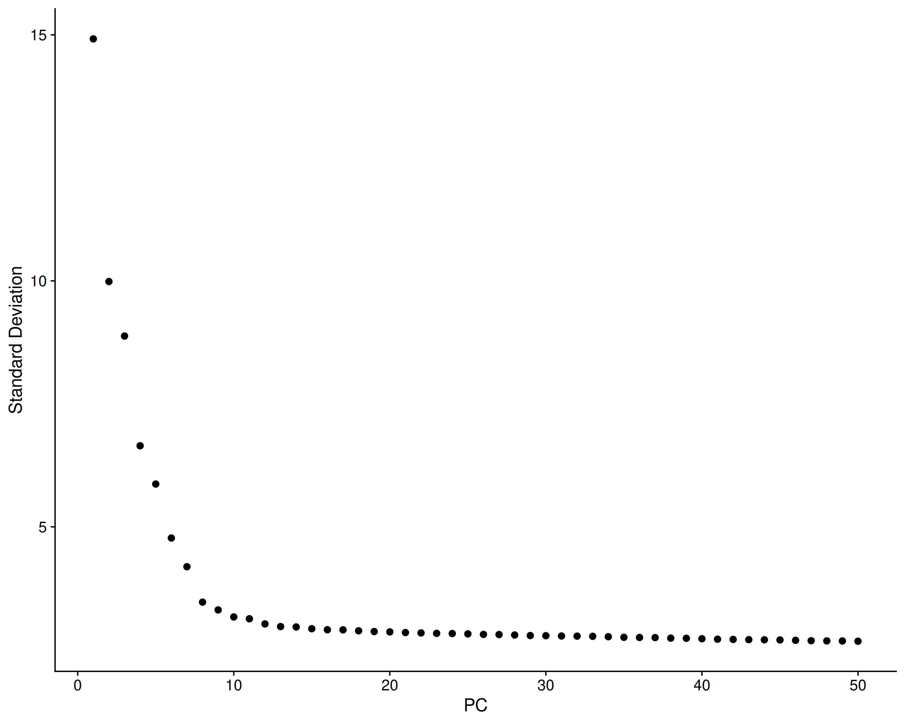<!-- -->

alt=“PCA Analysis: Elbow plot showing explained variance by principal
components” /\> explained variance by principal components
</figcaption>

``` r
# Determine optimal number of PCs
pct <- combined[["pca"]]@stdev / sum(combined[["pca"]]@stdev) * 100
cumu <- cumsum(pct)
co1 <- which(cumu > 90 & pct < 5)[1]
co2 <- sort(which((pct[1:length(pct) - 1] - pct[2:length(pct)]) > 0.1), decreasing = T)[1] + 1
pcs <- min(co1, co2)

cat("Optimal number of PCs:", pcs, "\n")
```

    ## Optimal number of PCs: 8

## UMAP Clustering

UMAP is used for dimensionality reduction and visualization of cell
clusters. Different resolutions were tested.

``` r
VizDimLoadings(combined, dims = 1:8, reduction = "pca")
```

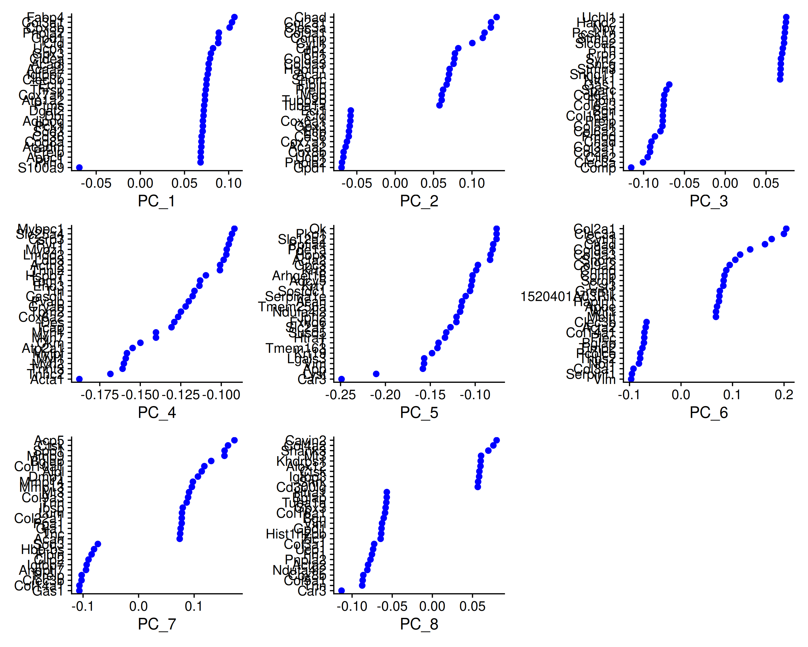<!-- -->

alt=“UMAP clustering with multiple resolutions” /\> resolutions
</figcaption>

``` r
DimHeatmap(combined, dims = 1:8, cells = 500, balanced = TRUE)
```

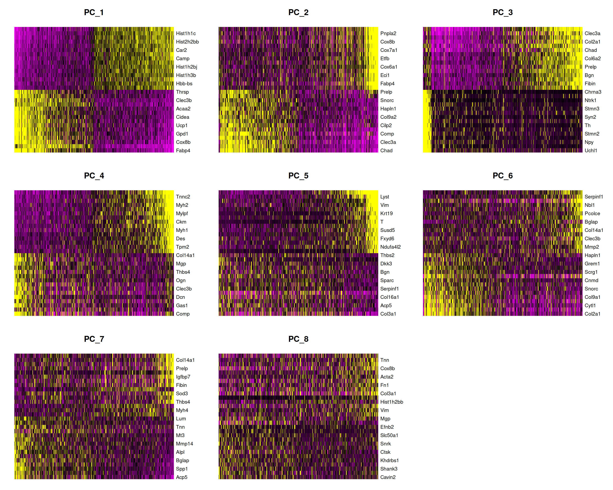<!-- -->

alt=“UMAP clustering with multiple resolutions” /\> resolutions
</figcaption>

``` r
combined <- RunUMAP(combined, dims = 1:8, verbose = FALSE)
combined <- FindNeighbors(combined, dims = 1:8, verbose = FALSE)
resolution_values <- c(0, 0.1, 0.2, 0.3, 0.4, 0.5, 0.6, 0.7, 0.8, 0.9, 1.0, 1.1, 1.2, 1.3)
combined <- FindClusters(combined, assay = "SCT", resolution = resolution_values)
```

    ## Modularity Optimizer version 1.3.0 by Ludo Waltman and Nees Jan van Eck
    ## 
    ## Number of nodes: 730
    ## Number of edges: 21471
    ## 
    ## Running Louvain algorithm...
    ## Maximum modularity in 10 random starts: 1.0000
    ## Number of communities: 1
    ## Elapsed time: 0 seconds
    ## Modularity Optimizer version 1.3.0 by Ludo Waltman and Nees Jan van Eck
    ## 
    ## Number of nodes: 730
    ## Number of edges: 21471
    ## 
    ## Running Louvain algorithm...
    ## Maximum modularity in 10 random starts: 0.9171
    ## Number of communities: 2
    ## Elapsed time: 0 seconds
    ## Modularity Optimizer version 1.3.0 by Ludo Waltman and Nees Jan van Eck
    ## 
    ## Number of nodes: 730
    ## Number of edges: 21471
    ## 
    ## Running Louvain algorithm...
    ## Maximum modularity in 10 random starts: 0.8706
    ## Number of communities: 3
    ## Elapsed time: 0 seconds
    ## Modularity Optimizer version 1.3.0 by Ludo Waltman and Nees Jan van Eck
    ## 
    ## Number of nodes: 730
    ## Number of edges: 21471
    ## 
    ## Running Louvain algorithm...
    ## Maximum modularity in 10 random starts: 0.8400
    ## Number of communities: 5
    ## Elapsed time: 0 seconds
    ## Modularity Optimizer version 1.3.0 by Ludo Waltman and Nees Jan van Eck
    ## 
    ## Number of nodes: 730
    ## Number of edges: 21471
    ## 
    ## Running Louvain algorithm...
    ## Maximum modularity in 10 random starts: 0.8147
    ## Number of communities: 6
    ## Elapsed time: 0 seconds
    ## Modularity Optimizer version 1.3.0 by Ludo Waltman and Nees Jan van Eck
    ## 
    ## Number of nodes: 730
    ## Number of edges: 21471
    ## 
    ## Running Louvain algorithm...
    ## Maximum modularity in 10 random starts: 0.7901
    ## Number of communities: 7
    ## Elapsed time: 0 seconds
    ## Modularity Optimizer version 1.3.0 by Ludo Waltman and Nees Jan van Eck
    ## 
    ## Number of nodes: 730
    ## Number of edges: 21471
    ## 
    ## Running Louvain algorithm...
    ## Maximum modularity in 10 random starts: 0.7706
    ## Number of communities: 7
    ## Elapsed time: 0 seconds
    ## Modularity Optimizer version 1.3.0 by Ludo Waltman and Nees Jan van Eck
    ## 
    ## Number of nodes: 730
    ## Number of edges: 21471
    ## 
    ## Running Louvain algorithm...
    ## Maximum modularity in 10 random starts: 0.7531
    ## Number of communities: 8
    ## Elapsed time: 0 seconds
    ## Modularity Optimizer version 1.3.0 by Ludo Waltman and Nees Jan van Eck
    ## 
    ## Number of nodes: 730
    ## Number of edges: 21471
    ## 
    ## Running Louvain algorithm...
    ## Maximum modularity in 10 random starts: 0.7374
    ## Number of communities: 8
    ## Elapsed time: 0 seconds
    ## Modularity Optimizer version 1.3.0 by Ludo Waltman and Nees Jan van Eck
    ## 
    ## Number of nodes: 730
    ## Number of edges: 21471
    ## 
    ## Running Louvain algorithm...
    ## Maximum modularity in 10 random starts: 0.7231
    ## Number of communities: 9
    ## Elapsed time: 0 seconds
    ## Modularity Optimizer version 1.3.0 by Ludo Waltman and Nees Jan van Eck
    ## 
    ## Number of nodes: 730
    ## Number of edges: 21471
    ## 
    ## Running Louvain algorithm...
    ## Maximum modularity in 10 random starts: 0.7085
    ## Number of communities: 10
    ## Elapsed time: 0 seconds
    ## Modularity Optimizer version 1.3.0 by Ludo Waltman and Nees Jan van Eck
    ## 
    ## Number of nodes: 730
    ## Number of edges: 21471
    ## 
    ## Running Louvain algorithm...
    ## Maximum modularity in 10 random starts: 0.6959
    ## Number of communities: 10
    ## Elapsed time: 0 seconds
    ## Modularity Optimizer version 1.3.0 by Ludo Waltman and Nees Jan van Eck
    ## 
    ## Number of nodes: 730
    ## Number of edges: 21471
    ## 
    ## Running Louvain algorithm...
    ## Maximum modularity in 10 random starts: 0.6835
    ## Number of communities: 11
    ## Elapsed time: 0 seconds
    ## Modularity Optimizer version 1.3.0 by Ludo Waltman and Nees Jan van Eck
    ## 
    ## Number of nodes: 730
    ## Number of edges: 21471
    ## 
    ## Running Louvain algorithm...
    ## Maximum modularity in 10 random starts: 0.6710
    ## Number of communities: 11
    ## Elapsed time: 0 seconds

``` r
# Clustree plot to visualize clustering stability
plot <- clustree(combined, prefix = "SCT_snn_res.")
plot
```

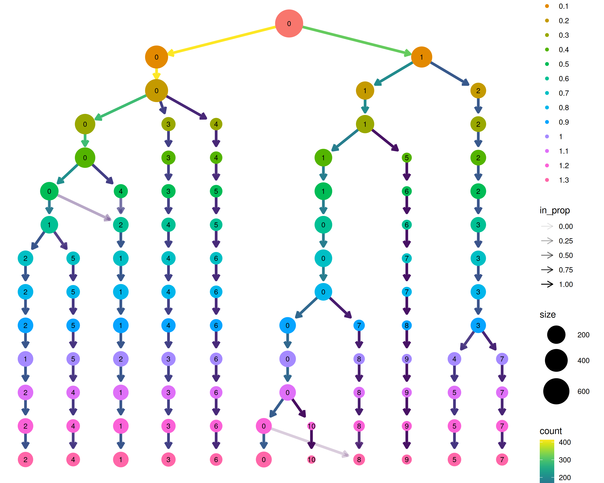<!-- -->

alt=“UMAP clustering with multiple resolutions” /\> resolutions
</figcaption>

## Cluster Visualization

The optimal clustering resolution (1.3) is used to visualize cell
populations and their spatial distribution.

``` r
# Res 1.3 was the best resolution for the UMAP
plot1 <- DimPlot(combined, reduction = "umap", group.by = "SCT_snn_res.1.3", split.by = "orig.ident", label = TRUE, ncol = 3, pt.size = 2,label.size = 5, cols=c('0' = 'red', '1' = 'cyan', '2' = 'gold','3' = 'green', '4' = 'magenta', '5' ='darkorchid','6' = 'blue','7' = 'brown', '8' = 'orange','9' = 'pink', '10' = 'forestgreen')) +
  theme(
    axis.text.x = element_text(family = "arial", size = 20),
    axis.text.y = element_text(family = "arial", size = 20),
    axis.title.x = element_text(family = "arial", size = 20),
    axis.title.y = element_text(family = "arial", size = 20),
    legend.text = element_text(family = "arial", size = 16),
    strip.text = element_text(size = 20, face = "bold"))

plot1
```

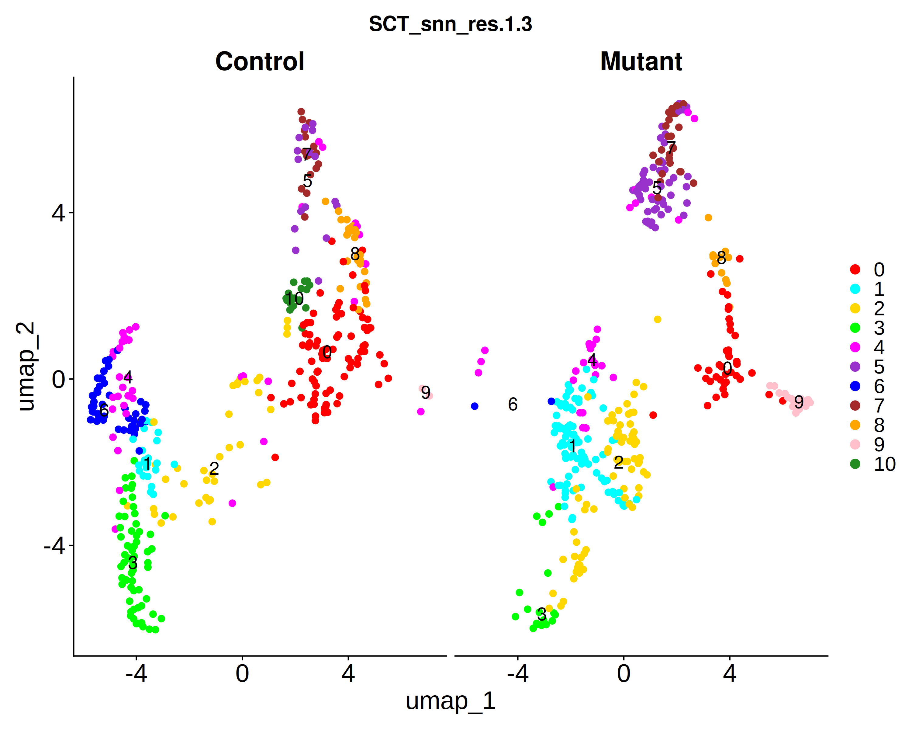<!-- -->

alt=“UMAP visualization of clusters split by sample condition” /\>
sample condition
</figcaption>

``` r
plot2 <- DimPlot(combined, reduction = "umap", group.by = c("SCT_snn_res.1.3", "orig.ident"), label = TRUE) 
wrap_plots(B = plot1, A = plot2, design = "BB
           AA")
```

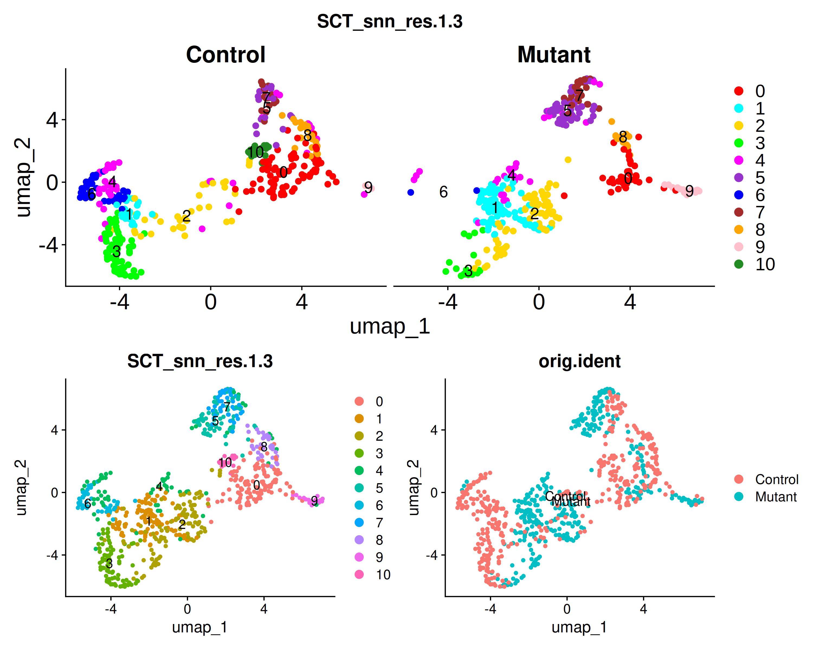<!-- -->

alt=“UMAP visualization of clusters split by sample condition” /\>
sample condition
</figcaption>

``` r
# Create condition metadata
cells <- Cells(combined)
combined$condition <- ifelse(
  startsWith(cells, "Mutant"),
  "Mutant",
  "Control"
)

cat("Cluster distribution:\n")
```

    ## Cluster distribution:

``` r
print(table(combined$seurat_clusters, combined$condition))
```

    ##     
    ##      Control Mutant
    ##   0       83     39
    ##   1       22     91
    ##   2       37     70
    ##   3       63     18
    ##   4       39     31
    ##   5       16     50
    ##   6       48      2
    ##   7       17     27
    ##   8       27     11
    ##   9        2     20
    ##   10      17      0

``` r
table(combined$seurat_clusters)
```

    ## 
    ##   0   1   2   3   4   5   6   7   8   9  10 
    ## 122 113 107  81  70  66  50  44  38  22  17

## Spatial Visualization

Spatial plots show the distribution of clusters across the tissue
sections. The spatial illustration of clustering matches biological
expectations.

``` r
# Switch to the Spatial assay
DefaultAssay(combined) <- "Spatial"

# Rename images for clarity
old <- names(combined@images)
new <- ifelse(old == "slice1", "Mutant",
              ifelse(old == "slice1.2", "Control", old))
names(combined@images) <- new
combined@images <- combined@images[c("Control","Mutant")]

# Spatial cluster plot
p2 <- SpatialDimPlot(
  combined,
  group.by = "seurat_clusters",
  pt.size = 1,
  crop=FALSE  # dim H&E background, keep spots vivid
)
p2
```

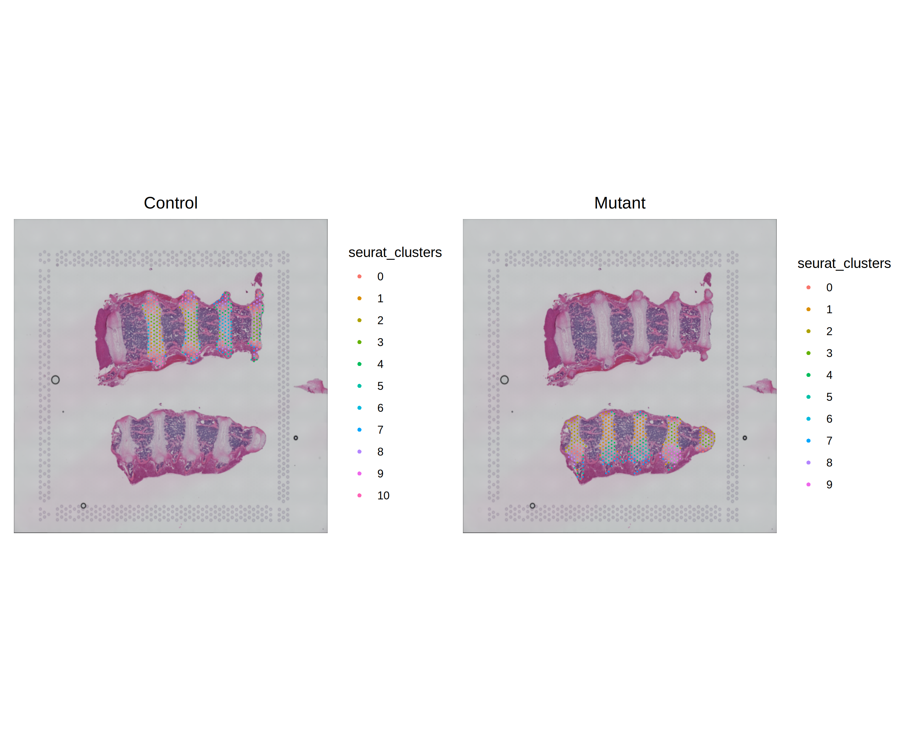<!-- -->

alt=“Spatial distribution of clusters across tissue sections” /\> tissue
sections
</figcaption>

# Refined Differential Expression (Handling Sampling Bias)

The initial global DE analysis may be confounded by sampling differences
(e.g., more muscle tissue in one sample). Here we apply three strategies
to obtain more robust biological differences specific to the IVD/Disc
tissue.

## Strategy: Muscle-Score Filtering

We remove spots with high expression of muscle-specific genes to ensure
the comparison is specific to the disc, independent of cluster
definitions.

``` r
# --- STRATEGY 4: Gene-based Filtering ---

# 1. Score every spot for "Muscle-ness"
muscle_genes <- c("Myh2", "Tnnc2", "Acta1", "Tnnt3", "Myl1")
# Check which are present in your data (specifically in Spatial assay)
available_genes <- rownames(combined@assays$Spatial)
muscle_genes <- muscle_genes[muscle_genes %in% available_genes]

if (length(muscle_genes) > 0) {
# Use PercentageFeatureSet instead of AddModuleScore for stability
# This calculates the percentage of total counts coming from muscle genes
# Explicitly use Spatial assay to ensure we use raw counts and all genes
combined[["Muscle_Pct"]] <- PercentageFeatureSet(combined, features = muscle_genes, assay = "Spatial")
  
# DEBUG: Print summary to check values
cat("Muscle Genes used:", paste(muscle_genes, collapse=", "), "\n")
cat("Summary of Muscle_Pct:\n")
print(summary(combined[["Muscle_Pct"]]))
  
# 2. Visualize the score distribution
# Using standard ggplot2 to avoid Seurat VlnPlot S4SXP errors
meta_df <- combined@meta.data
p_muscle <- ggplot(meta_df, aes(x = condition, y = Muscle_Pct, fill = condition)) +
          geom_violin() +
          geom_jitter(height = 0, width = 0.1, alpha = 0.1) +
          geom_hline(yintercept = 5, linetype="dashed", color = "red") +
          theme_minimal() +
          ggtitle("Muscle Expression Percentage")
print(p_muscle)
  
# 3. Filter out spots with high muscle scores
# Using 1% as a conservative cutoff (adjust based on the Violin plot output)
# Spots with >1% of their reads from muscle genes are likely muscle contamination
combined_no_muscle <- subset(combined, subset = Muscle_Pct < 1)
# Visualize the spots left after muscle filtering on the spatial dim plot (no scaling)
print(SpatialDimPlot(combined_no_muscle, crop = FALSE, pt.size.factor = 1))

cat("Original spots:", ncol(combined), "\n")
cat("Spots after muscle filtering:", ncol(combined_no_muscle), "\n")
  
# 4. Run DE on non-muscle spots
## Method 1: The SCT Approach
Idents(combined_no_muscle) <- "condition"
combined_no_muscle$condition <- factor(combined_no_muscle$condition, levels = c("Control", "Mutant"))
  
de_no_muscle <- FindMarkers(
    combined_no_muscle,
    ident.1 = "Mutant",
    ident.2 = "Control",
    assay = "SCT",
    recorrect_umi = FALSE,
    logfc.threshold = 0.25,
    min.pct = 0.1
  )
  
cat("\nTop genes after removing muscle spots:\n")
print(head(de_no_muscle))
# Critique: While SCTransform is excellent for normalization and clustering, using assay = "SCT" for differential expression can be tricky. The values in the scale.data slot are Pearson residuals, not true expression counts, which can lead to difficulties in interpreting "Fold Change." Furthermore, if the object is merged, the SCT model might not align perfectly across samples without running PrepSCTFindMarkers.

## Method 2: The Standard Spatial Approach 
#To obtain the most accurate Log Fold Changes and P-values, we return to the standard Log-Normalization workflow on the Spatial (raw counts) assay.

#Critical Step for Seurat V5: In Seurat V5, merged objects store data in separate "layers" (e.g., counts.1, counts.2). If we try to run DE immediately, the function will fail because the data is fragmented. We must use JoinLayers to unify the counts into a single matrix before normalization.

# 1. Join the layers so Seurat sees one unified dataset
combined_no_muscle1 <- JoinLayers(combined_no_muscle)

# 2. Normalize the unified data (Standard log normalization)
DefaultAssay(combined_no_muscle1) <- "Spatial"
combined_no_muscle1 <- NormalizeData(combined_no_muscle1)

# 3. NOW run FindMarkers
de_no_muscle <- FindMarkers(
  combined_no_muscle1,
  ident.1 = "Mutant",
  ident.2 = "Control",
  assay = "Spatial",      
  test.use = "wilcox",    
  logfc.threshold = 0.25,
  min.pct = 0.1          
)

# 4. View results
head(de_no_muscle)
write.csv(de_no_muscle, "2022IVD_NoMuscle_Mutant_vs_Control.csv")

# --- Volcano Plot for Clean (No-Muscle) Data ---
de_no_muscle$gene <- rownames(de_no_muscle)

# Rename 1520401A03Rik to Grep1
de_no_muscle$gene[de_no_muscle$gene == "1520401A03Rik"] <- "Grep1"
rownames(de_no_muscle)[rownames(de_no_muscle) == "1520401A03Rik"] <- "Grep1"

de_no_muscle$significance <- "Not Significant"
de_no_muscle$significance[de_no_muscle$p_val_adj < 0.05 & de_no_muscle$avg_log2FC > 0.25] <- "Up in Mutant"
de_no_muscle$significance[de_no_muscle$p_val_adj < 0.05 & de_no_muscle$avg_log2FC < -0.25] <- "Down in Mutant"

top_clean_genes <- de_no_muscle %>%
    filter(significance != "Not Significant") %>%
    group_by(significance) %>%
    arrange(desc(abs(avg_log2FC))) %>%
    slice_head(n = 25) %>%
    ungroup()

# Define specific genes of interest
highlight_genes <- c("Myh2", "Grep1", "Apobec2", "Ryr1", "Cnmd", "Matn3", "Col9a2", "Chad", "Acan", "Snorc", "Sox9", "Col2a1", "Mgp", "Ucp2", "Cidea", "Ucp1")
top_genes <- c(top_clean_genes$gene,highlight_genes )

p_clean_volcano <- ggplot(de_no_muscle, aes(x = avg_log2FC, y = -log10(p_val_adj))) +
    geom_point(aes(color = significance), alpha = 0.6) +
    scale_color_manual(values = c("Up in Mutant" = "firebrick", "Down in Mutant" = "steelblue", "Not Significant" = "grey70")) +
    geom_text_repel(
      data = top_clean_genes,
      aes(label = gene),
      size = 5,
      box.padding = 0.5,
      max.overlaps = Inf,
      family = "Arial"
    ) +
    geom_vline(xintercept = c(-0.25, 0.25), linetype = "dashed", color = "black") +
    geom_hline(yintercept = -log10(0.05), linetype = "dashed", color = "black") +
    ggtitle("Volcano Plot: Clean Data (No Muscle) - Mutant vs Control") +
    theme_minimal(base_size = 15, base_family = "Arial")

print(p_clean_volcano)

```

    ## Muscle Genes used: Myh2, Tnnc2, Acta1, Tnnt3, Myl1 
    ## Summary of Muscle_Pct:
    ##    Muscle_Pct     
    ##  Min.   :0.00000  
    ##  1st Qu.:0.02650  
    ##  Median :0.07879  
    ##  Mean   :0.24889  
    ##  3rd Qu.:0.26590  
    ##  Max.   :9.29750

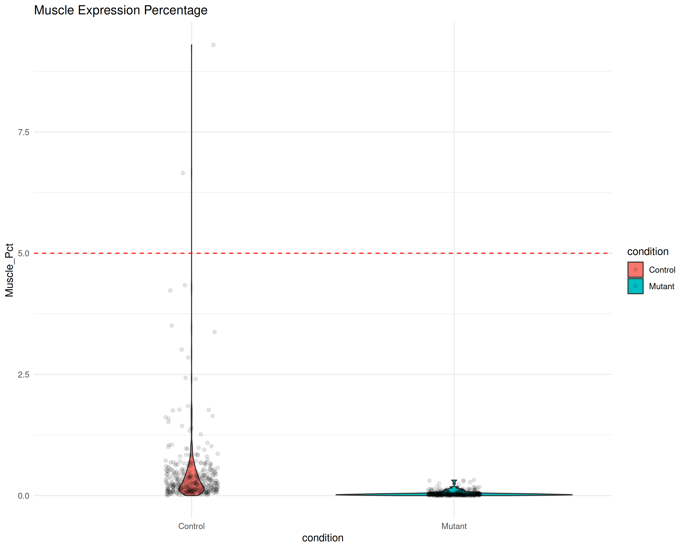<!-- -->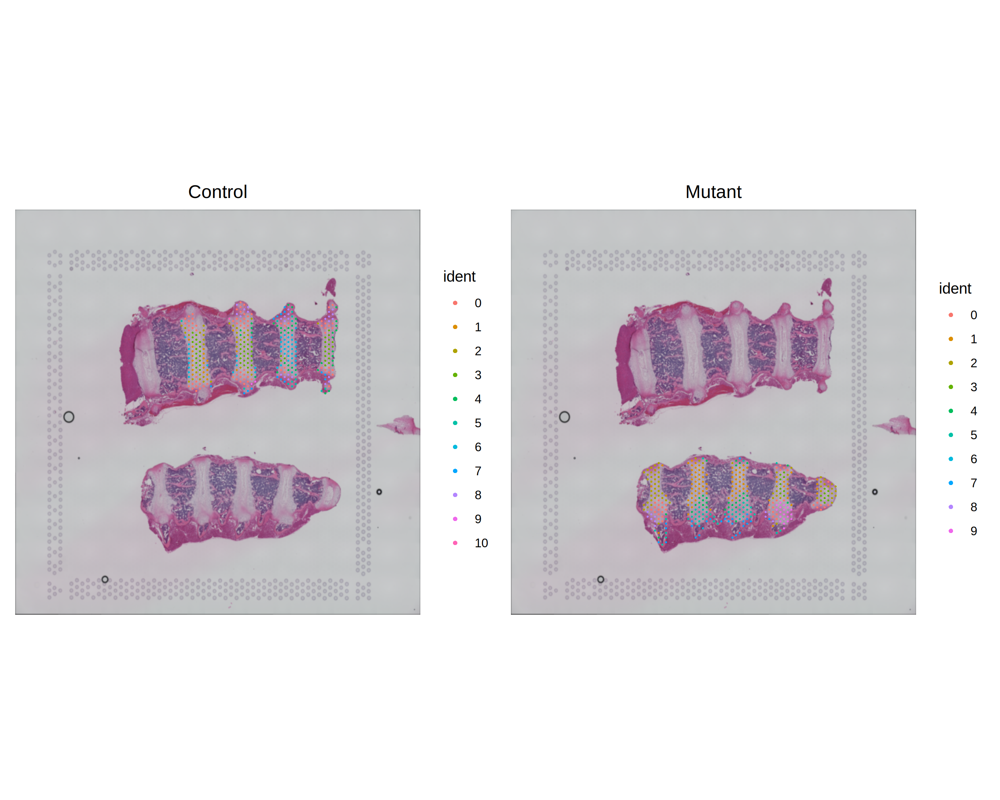<!-- -->

    ## Original spots: 730 
    ## Spots after muscle filtering: 703 
    ## 
    ## Top genes after removing muscle spots:
    ##               p_val avg_log2FC pct.1 pct.2    p_val_adj
    ## Tmsb4x 1.525525e-78  0.7895359 1.000 1.000 2.666617e-74
    ## Ucp1   4.520003e-76  2.6690201 0.967 0.541 7.900965e-72
    ## Acta1  3.037976e-71 -2.5947791 0.507 0.942 5.310382e-67
    ## Fth1   4.178244e-66  0.7193569 1.000 1.000 7.303571e-62
    ## Tkt    6.923228e-66  1.0152708 1.000 0.994 1.210180e-61
    ## Myh2   3.550123e-60 -3.3397310 0.167 0.753 6.205616e-56

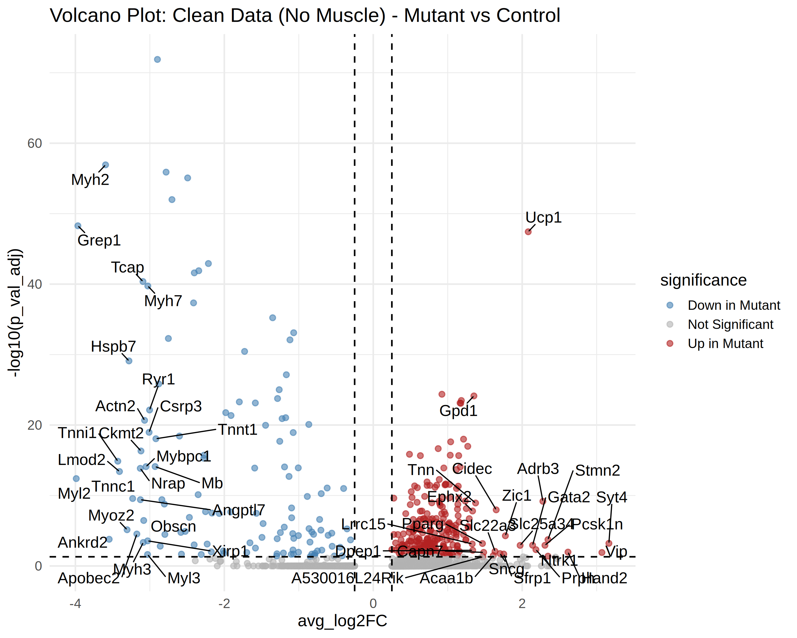<!-- -->

## Re-clustering using the muscle spots removed data

Re-clustering the combined_no_muscle data is highly recommended.
Removing the muscle spots changes the variance structure of dataset. By
re-running normalization (SCT), PCA, and UMAP on the cleaned subset, the
analysis will focus on the biological heterogeneity within the disc
tissue, rather than being dominated by the strong “Muscle vs. Disc”
differences that drove the original clustering.

``` r
# --- RE-CLUSTERING ON CLEAN DATA (combined_no_muscle) ---
cat("\nRe-clustering combined_no_muscle to refine variance structure...\n")
```

    ## 
    ## Re-clustering combined_no_muscle to refine variance structure...

``` r
# 1. Re-normalize using SCTransform
# This is CRITICAL: Subsetting removes scale.data/SCT model, so we must re-run it.
combined_no_muscle <- SCTransform(combined_no_muscle, assay = "Spatial", verbose = FALSE)
  
# 2. Run PCA
combined_no_muscle <- RunPCA(combined_no_muscle, verbose = FALSE)
  
# Determine optimal number of PCs
pct <- combined_no_muscle[["pca"]]@stdev / sum(combined[["pca"]]@stdev) * 100
cumu <- cumsum(pct)
co1 <- which(cumu > 90 & pct < 5)[1]
co2 <- sort(which((pct[1:length(pct) - 1] - pct[2:length(pct)]) > 0.1), decreasing = T)[1] + 1
pcs <- min(co1, co2)
pcs
```

    ## [1] 9

``` r
cat("Optimal number of PCs:", pcs, "\n")
```

    ## Optimal number of PCs: 9

``` r
# 3. Run UMAP
combined_no_muscle <- RunUMAP(combined_no_muscle, dims = 1:9, verbose = FALSE)
  
# 4. Find Neighbors & Clusters
combined_no_muscle <- FindNeighbors(combined_no_muscle, dims = 1:9, verbose = FALSE)
combined_no_muscle <- FindClusters(combined_no_muscle, resolution = 0.5, verbose = FALSE) # Adjust resolution if needed

# 5. OVERWRITE GLOBAL OBJECT
# This ensures all downstream chunks (ScType, GO, FeaturePlots) use the CLEAN data
combined <- combined_no_muscle
  
plot1 <- DimPlot(combined, reduction = "umap",split.by = "orig.ident", label = TRUE, ncol = 3, pt.size = 2,label.size = 5, cols=c('0' = 'red', '1' = 'cyan', '2' = 'gold','3' = 'green', '4' = 'magenta', '5' ='darkorchid','6' = 'blue','7' = 'brown')) +
  theme(
    axis.text.x = element_text(family = "arial", size = 20),
    axis.text.y = element_text(family = "arial", size = 20),
    axis.title.x = element_text(family = "arial", size = 20),
    axis.title.y = element_text(family = "arial", size = 20),
    legend.text = element_text(family = "arial", size = 16),
    strip.text = element_text(size = 20, face = "bold"))

plot1
```

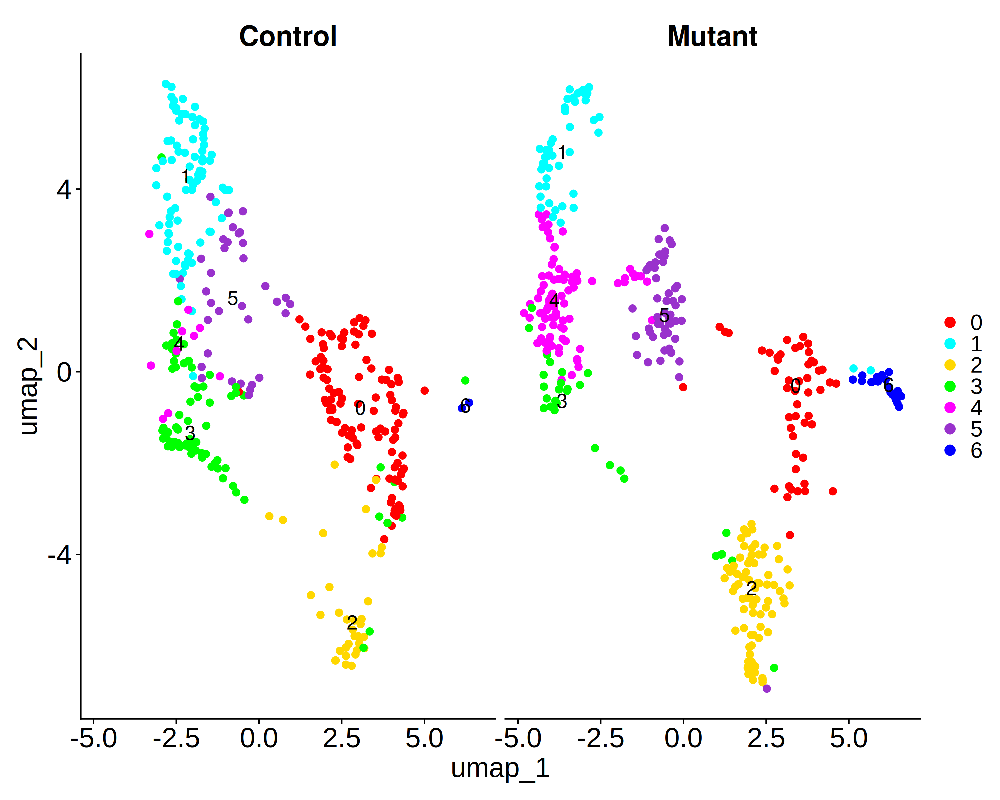<!-- -->

``` r
plot2 <- DimPlot(combined, reduction = "umap", group.by = c("SCT_snn_res.1.3", "orig.ident"), label = TRUE) 
wrap_plots(B = plot1, A = plot2, design = "BB
           AA")
```

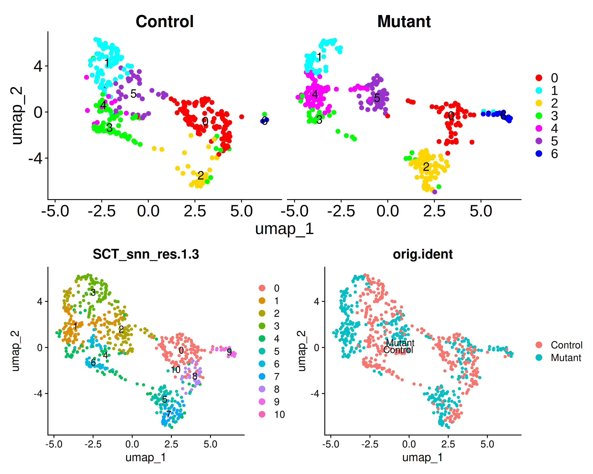<!-- -->

``` r
# Spatial visualization (Simplified)
combined_control <- subset(combined, subset = condition == "Control")
combined_mutant <- subset(combined, subset = condition == "Mutant")

figure_b_Control <- SpatialDimPlot(
  combined_control,
  group.by = 'seurat_clusters',
  label = FALSE,             # turn off labels for cleaner view
  ncol = 1,
  pt.size.factor = 1.5,
  crop = FALSE,
  alpha = c(1, 2),image.alpha=0.5, cols=c('0' = 'red', '1' = 'cyan', '2' = 'gold','3' = 'green', '4' = 'magenta', '5' ='darkorchid','6' = 'blue','7' = 'brown')
) + NoLegend() + ggtitle("Control") +
  theme(
    plot.title = element_text(hjust = 0.5, vjust = 0.5),
    text = element_text(size = 18.5)
  )

figure_b_Mutant <- SpatialDimPlot(
  combined_mutant,
  group.by = 'seurat_clusters',
  label = FALSE,             # turn off labels
  ncol = 1,
  pt.size.factor = 1.5,
  crop = FALSE,
  alpha = c(1,2),image.alpha=0.5, cols=c('0' = 'red', '1' = 'cyan', '2' = 'gold','3' = 'green', '4' = 'magenta', '5' ='darkorchid','6' = 'blue','7' = 'brown')
) + ggtitle("Mutant") +
  theme(
    plot.title = element_text(hjust = 0.5, vjust = 0.5),
    text = element_text(size = 18.5)
  )

figure_b1 <- wrap_plots(figure_b_Control, figure_b_Mutant)
figure_b1
```

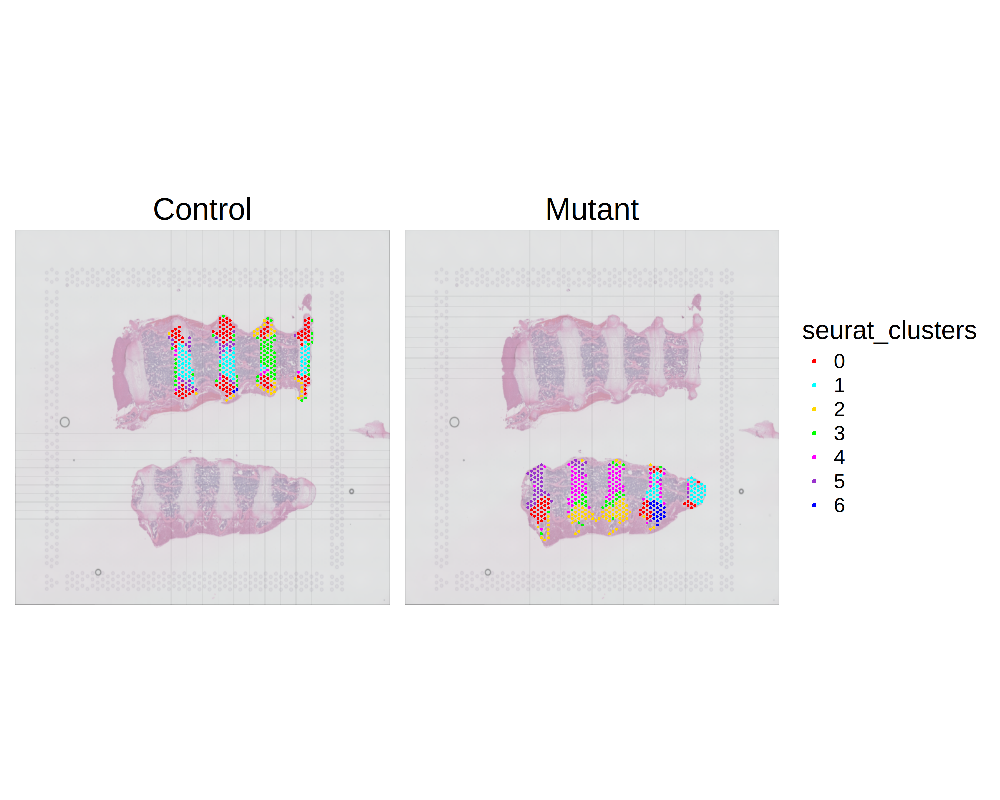<!-- -->

``` r
wrap_plots(B = plot1, A = figure_b1, design = "BB
           AA")
```

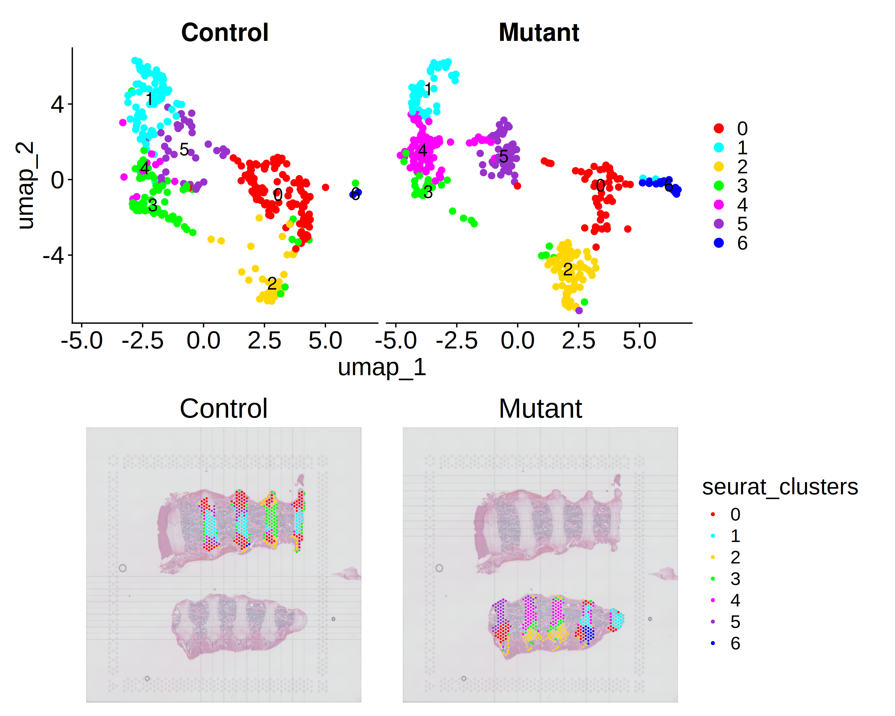<!-- -->

``` r
# 6. UPDATE de_df FOR downstream ANALYSIS
# The downstream GO chunks look for 'de_df'. We set it to our clean DE results.
# de_no_muscle already has 'gene' and 'significance' columns from the Volcano Plot section above.
de_df <- de_no_muscle %>%
  dplyr::select(gene, avg_log2FC, p_val_adj, significance)

    
cat("Global 'combined' object updated to 'combined_no_muscle'.\n")
```

    ## Global 'combined' object updated to 'combined_no_muscle'.

``` r
cat("Global 'de_df' updated to Strategy 4 (No-Muscle) results.\n")
```

    ## Global 'de_df' updated to Strategy 4 (No-Muscle) results.

## All Cluster Markers

We then identify cluster-enriched genes (high in one cluster, low
elsewhere), of which the expressions are different across clusters. We
define a cluster marker when a gene is expressed in \>50% of cells in a
cluster, while it’s mostly absent elsewhere (\<10%).

``` r
Idents(combined) <- "seurat_clusters"

de_cluster <- FindAllMarkers(
  object        = combined,
  assay         = "SCT",
  slot          = "data",
  test.use      = "wilcox",
  logfc.threshold = 0.25,
  min.pct       = 0.1,recorrect_umi=FALSE
)

write.csv(de_cluster, file = "2022IVDonly_cluster_DE_genes.csv", row.names = TRUE)

# Get the unique cluster identities from your combined object
all_clusters <- unique(Idents(combined))

# loop to get top genes
num_top_genes <- 25
min_pct_in_cluster <- 0.25

top_genes_per_cluster <- list()

for (cluster_id in all_clusters) {
  top_genes_per_cluster[[as.character(cluster_id)]] <- de_cluster %>%
    filter(cluster == cluster_id,
           avg_log2FC > 0,
           pct.1 >= min_pct_in_cluster) %>%
    arrange(desc(avg_log2FC)) %>%
    head(num_top_genes) %>%
    pull(gene)
}

cat("Top marker genes per cluster:\n")
```

    ## Top marker genes per cluster:

``` r
print(top_genes_per_cluster)
```

    ## $`4`
    ##  [1] "Fanca"         "Malt1"         "Lin28a"        "Tonsl"        
    ##  [5] "4930404N11Rik" "Tbxas1"        "BC055324"      "Cdca7l"       
    ##  [9] "Mcemp1"        "Rtel1"         "Cenpu"         "Olfm4"        
    ## [13] "Fignl1"        "Tacc3"         "Blm"           "Galns"        
    ## [17] "Stil"          "Rad54l"        "Ube2c"         "Ikzf3"        
    ## [21] "Ms4a3"         "Rinl"          "Trmo"          "Haus5"        
    ## [25] "Itgam"        
    ## 
    ## $`5`
    ##  [1] "Mobp"     "Prg2"     "Casq1"    "Agt"      "Pgam2"    "Fcrla"   
    ##  [7] "Bach2"    "Atg5"     "Nemf"     "Myh7"     "Ocstamp"  "Arhgef39"
    ## [13] "Mbp"      "Cd79b"    "Acp5"     "Acta1"    "Spib"     "Mpo"     
    ## [19] "Cd72"     "Ctsk"     "Myl1"     "Mmp9"     "Clec12a"  "Atp2a1"  
    ## [25] "Myh2"    
    ## 
    ## $`0`
    ##  [1] "Clec3a"  "Chad"    "Col2a1"  "Cnmd"    "Cilp2"   "Angptl7" "Abi3bp" 
    ##  [8] "Comp"    "Nfatc2"  "Clec3b"  "Thbs4"   "Fibin"   "Extl1"   "Cytl1"  
    ## [15] "Scrg1"   "Fmod"    "Col9a2"  "Ecm2"    "Pax1"    "Col14a1" "Prelp"  
    ## [22] "Chadl"   "Emilin3" "Calml3"  "Trpv4"  
    ## 
    ## $`6`
    ##  [1] "Caly"     "Hand1"    "Epha10"   "Gprin1"   "Areg"     "Hmx1"    
    ##  [7] "Zdhhc22"  "Unc5a"    "Kcnh7"    "Th"       "Syn2"     "Insm2"   
    ## [13] "Dbh"      "Vstm2l"   "Ntrk1"    "Hand2"    "Phox2a"   "Ccdc184" 
    ## [19] "B4galnt4" "Chga"     "Pcsk1n"   "Sncb"     "Vip"      "Syngr3"  
    ## [25] "Nrsn2"   
    ## 
    ## $`2`
    ##  [1] "Lgals12" "Ppara"   "Tmem79"  "Cidec"   "Kcnk3"   "Otop1"   "Slc22a3"
    ##  [8] "Echdc3"  "Ebf2"    "Pparg"   "Cox7a1"  "Ces1d"   "Gpd1"    "Adig"   
    ## [15] "Npr3"    "Adrb3"   "Klf15"   "Pck1"    "Papln"   "Pld6"    "Pdk4"   
    ## [22] "Cfd"     "Adtrp"   "Acaa1b"  "Cyp2u1" 
    ## 
    ## $`1`
    ##  [1] "Krt19"     "T"         "Krt8"      "Arhgef16"  "Tmem255a"  "Krt7"     
    ##  [7] "Ppfia4"    "Lyst"      "Serpina1e" "Sostdc1"   "Tmem163"   "Adcy5"    
    ## [13] "Jph2"      "Rab38"     "Car3"      "Slc12a2"   "Pde1a"     "Fxyd6"    
    ## [19] "Slc2a1"    "Hopx"      "Lgals3"    "Hspa12a"   "Gpc3"      "Ppp1r3c"  
    ## [25] "Susd5"    
    ## 
    ## $`3`
    ##  [1] "Stfa3"     "Usp1"      "Bbip1"     "Cks2"      "Siah1b"    "Xk"       
    ##  [7] "Cdc7"      "Hist3h2ba" "Dynlt1a"   "Lsm2"      "Cdca2"     "Tac2"     
    ## [13] "Abt1"      "Hist2h2ab" "Uros"      "Phex"      "Gtf2e1"    "Nuf2"     
    ## [19] "Clspn"     "Stat1"     "Polr1b"    "Taf11"     "Nudt22"    "Cep70"    
    ## [25] "Sapcd2"

``` r
write.csv(top_genes_per_cluster, file = "top_genes_per_cluster.csv", row.names = FALSE)
# Define Cluster_markers variable for downstream analysis
Cluster_markers <- de_cluster%>%
  dplyr::filter(pct.1 > 0.5 & pct.2 < 0.1)

# Generate Top 20 Marker Table for Manuscript
# Create a clean table with: Cluster, Gene, LogFC, Pct.In, Pct.Out, Adj.P.Val
top20_markers_df <- de_cluster %>%
  dplyr::filter(avg_log2FC > 0) %>%             # Keep only upregulated genes (markers)
  dplyr::group_by(cluster) %>%
  dplyr::arrange(dplyr::desc(avg_log2FC)) %>%   # Sort by fold change
  dplyr::slice_head(n = 20) %>%                 # Take top 20 per cluster
  dplyr::select(cluster, gene, avg_log2FC, pct.1, pct.2, p_val_adj)

# Save to Excel
if (!requireNamespace("openxlsx", quietly = TRUE)) install.packages("openxlsx")
library(openxlsx)
write.xlsx(top20_markers_df, file = "Top20_Cluster_Markers_Manuscript.xlsx", overwrite = TRUE)
cat("Top 20 cluster markers saved to Top20_Cluster_Markers_Manuscript.xlsx\n")
```

    ## Top 20 cluster markers saved to Top20_Cluster_Markers_Manuscript.xlsx

### Volcano Plots of Cluster Markers (Cluster vs. All)

Visualizing the marker genes for each cluster using volcano plots.

``` r
# Ensure de_cluster exists
if (exists("de_cluster")) {
  
  # Get unique clusters
  clusters <- sort(unique(de_cluster$cluster))
  
  # Function to make a volcano plot for one cluster
  make_marker_volcano <- function(cl_id, full_df) {
    # Subset data for this cluster
    df_sub <- full_df %>% filter(cluster == cl_id)
    
    # Create significance column
    # We are primarily interested in UP-regulated markers (Positive FC)
    df_sub <- df_sub %>%
      mutate(
        significance = case_when(
          p_val_adj < 0.05 & avg_log2FC > 0.25 ~ "Marker (Up)",
          p_val_adj < 0.05 & avg_log2FC < -0.25 ~ "Down",
          TRUE ~ "Not Sig"
        )
      )
    
    # Select top genes to label (Top 10 by FC)
    top_genes <- df_sub %>%
      filter(significance == "Marker (Up)") %>%
      arrange(desc(avg_log2FC)) %>%
      head(10)
    
    # Plot
    p <- ggplot(df_sub, aes(x = avg_log2FC, y = -log10(p_val_adj))) +
      geom_point(aes(color = significance), alpha = 0.6, size = 1) +
      scale_color_manual(values = c("Marker (Up)" = "firebrick", "Down" = "steelblue", "Not Sig" = "grey80")) +
      geom_text_repel(data = top_genes, aes(label = gene), size = 3, max.overlaps = 15) +
      ggtitle(paste("Cluster", cl_id, "Markers")) +
      theme_minimal() +
      theme(legend.position = "none", plot.title = element_text(hjust = 0.5, size = 12, face="bold"))
    
    return(p)
  }
  
  # Generate list of plots
  volcano_list <- lapply(clusters, make_marker_volcano, full_df = de_cluster)
  
  # Combine into a grid
  marker_volcano_grid <- wrap_plots(volcano_list, ncol = 3)
  print(marker_volcano_grid)
  
  # Save
  ggsave("Cluster_Marker_Volcano_Grid.png", marker_volcano_grid, width = 8.5, height = 11)
  
} else {
  cat("de_cluster object not found. Run 'All Cluster Markers' chunk first.\n")
}
```

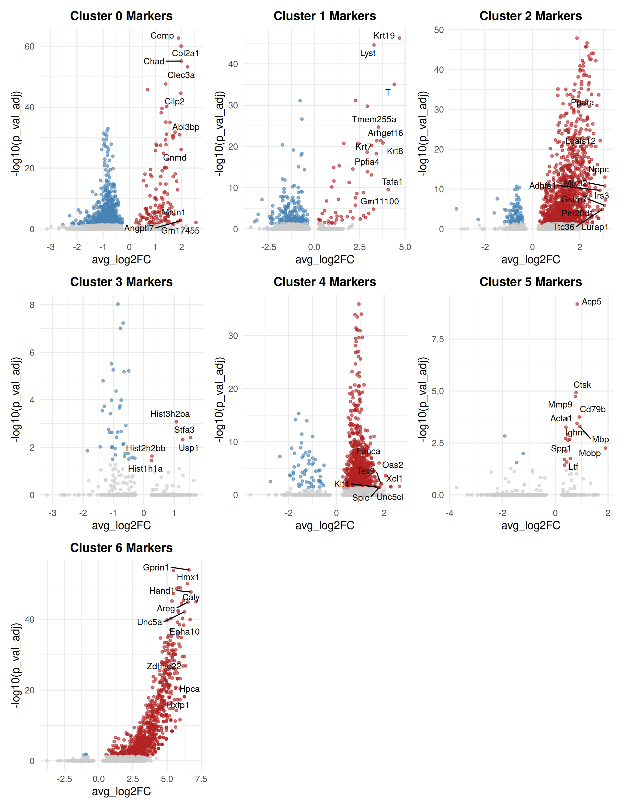<!-- -->

alt=“Volcano plots of Cluster Marker Genes (One vs Rest)” /\> (One vs
Rest)
</figcaption>

## Cluster-specific Volcano Plots (Mutant vs Control)

Compare Mutant vs Control expression within each cluster (spatial spots
regions) to highlight condition-specific responses, and summarize the
top genes driving each cluster’s differential signature. Highlighted
points correspond to the top cluster marker genes identified earlier
(`top_genes_per_cluster`), making it easy to track canonical markers
alongside condition-driven shifts.

``` r
if (!all(c("seurat_clusters", "condition") %in% colnames(combined@meta.data))) {
  stop("Combined object must contain both `seurat_clusters` and `condition` metadata.")
}

DefaultAssay(combined) <- "SCT"
Idents(combined) <- "seurat_clusters"
cluster_ids <- sort(unique(Idents(combined)))

cluster_condition_de <- purrr::map_dfr(cluster_ids, function(cl) {
  cells_cl <- WhichCells(combined, idents = cl)
  subset_obj <- subset(combined, cells = cells_cl)
  
  if (length(unique(subset_obj$condition)) < 2) {
    return(tibble::tibble())
  }
  
  Idents(subset_obj) <- "condition"
  markers <- tryCatch({
    FindMarkers(
      subset_obj,
      ident.1 = "Mutant",
      ident.2 = "Control",
      assay = "SCT",
      slot = "data",
      test.use = "wilcox",
      logfc.threshold = 0,
      min.pct = 0.1,
      recorrect_umi = FALSE
    )
  }, error = function(e) NULL)
  
  if (is.null(markers) || nrow(markers) == 0) {
    return(tibble::tibble())
  }
  
  markers %>%
    tibble::rownames_to_column("gene") %>%
    dplyr::mutate(cluster = cl)
})

if (nrow(cluster_condition_de) == 0) {
  warning("No cluster-level Mutant vs Control DE results were generated.")
} else {
  cluster_thresholds <- list(logfc = 0.25, padj = 0.05)
  cluster_highlight_genes <- purrr::map(
    setNames(cluster_ids, cluster_ids),
    function(cl) {
      if (exists("top_genes_per_cluster") &&
          cl %in% names(top_genes_per_cluster)) {
        head(top_genes_per_cluster[[as.character(cl)]], 5)
      } else {
        character(0)
      }
    }
  )
  
cluster_volcano_data <- cluster_condition_de %>%
  dplyr::mutate(
    negLogP = -log10(.data$p_val_adj + 1e-300),
    significance = dplyr::case_when(
      .data$avg_log2FC >= cluster_thresholds$logfc & .data$p_val_adj < cluster_thresholds$padj ~ "Up in Mutant",
      .data$avg_log2FC <= -cluster_thresholds$logfc & .data$p_val_adj < cluster_thresholds$padj ~ "Up in Control",
      TRUE ~ "Not significant"
      )
    )
  
volcano_palette <- c(
    "Up in Mutant" = "firebrick",
    "Up in Control" = "steelblue",
    "Not significant" = "grey70"
  )
  
build_cluster_volcano <- function(df, cluster_id, highlight_genes = character(0)) {
    if (nrow(df) == 0) {
      empty_plot <- ggplot() +
        annotate("text", x = 0, y = 0, label = "No DE genes", size = 4) +
        labs(title = paste("Cluster", cluster_id), x = NULL, y = NULL) +
        theme_void() +
        theme(plot.title = element_text(hjust = 0.5, face = "bold"))
      return(list(plot = empty_plot, top_genes = character(0)))
    }
    
# FORCE ADD "Ryr1" TO HIGHLIGHT LIST
highlight_genes <- unique(c(highlight_genes, "Ryr1"))
    
df <- df %>%
    dplyr::mutate(highlight = .data$gene %in% highlight_genes)
    
label_df <- df %>%
    arrange(.data$p_val_adj) %>%
    head(10) %>%
    filter(.data$significance != "Not significant")
    
highlight_labels <- df %>%
    filter(.data$highlight) %>%
    head(10)
    
label_df <- dplyr::bind_rows(label_df, highlight_labels) %>%
    distinct(.data$gene, .keep_all = TRUE)
    
plot <- ggplot(df, aes(x = .data$avg_log2FC, y = .data$negLogP, color = .data$significance)) +
      geom_point(alpha = 0.7, size = 1.4) +
      scale_color_manual(values = volcano_palette) +
      geom_vline(xintercept = c(-cluster_thresholds$logfc, cluster_thresholds$logfc), linetype = "dashed") +
      geom_hline(yintercept = -log10(cluster_thresholds$padj), linetype = "dashed") +
      labs(
        x = "Log Fold Change (Mutant vs Control)",
        y = "-Log10 Adjusted P-value",
        color = NULL,
        title = paste("Cluster", cluster_id)
      ) +
      theme_minimal(base_size = 12) +
      theme(
        plot.title = element_text(hjust = 0.5, face = "bold"),
        legend.position = "none"
      )
    
    if (any(df$highlight)) {
      plot <- plot +
        geom_point(
          data = df %>% filter(.data$highlight),
          aes(x = .data$avg_log2FC, y = .data$negLogP),
          inherit.aes = FALSE,
          color = "black",  # Black border for highlighted points
          size = 2.5,
          shape = 21,
          stroke = 0.8,
          fill = "gold"
        )
    }
    
top_hits <- df %>%
      arrange(.data$p_val_adj) %>%
      slice_head(n = 5) %>%
      dplyr::pull(.data$gene)
    
    if (nrow(label_df) > 0) {
      plot <- plot +
        geom_text_repel(
          data = label_df,
          aes(label = .data$gene),
          size = 3,
          max.overlaps = 15
        )
    }
    
    list(plot = plot, top_genes = top_hits)
  }
  
cluster_volcano_plots <- purrr::map(cluster_ids, function(cl) {
    cluster_data <- cluster_volcano_data %>% dplyr::filter(.data$cluster == cl)
    highlight_genes <- cluster_highlight_genes[[as.character(cl)]]
    build_cluster_volcano(cluster_data, cl, highlight_genes)
  })
  
plot_list <- purrr::map(cluster_volcano_plots, "plot")
  cluster_volcano_grid <- wrap_plots(plot_list, ncol = 2)
cluster_volcano_grid
  
cluster_top_genes <- purrr::map2_dfr(cluster_ids, cluster_volcano_plots, function(cl, res) {
    if (length(res$top_genes) == 0) {
      return(tibble::tibble())
    }
    tibble::tibble(
      cluster = cl,
      gene = res$top_genes
    )
  })
  
cat("Top expressed DE genes per cluster (Mutant vs Control):\n")
print(cluster_top_genes)
  
write.csv(cluster_top_genes, file = "cluster_condition_top_genes.csv", row.names = FALSE)
  
ggsave(
    filename = "volcano_per_cluster_condition.png",
    plot = cluster_volcano_grid,
    width = 15,
    height = max(4, ceiling(length(cluster_volcano_plots) / 2) * 4),
    dpi = 300,
    bg = "white"
  )
}
```

    ## Top expressed DE genes per cluster (Mutant vs Control):
    ## # A tibble: 30 × 2
    ##    cluster gene    
    ##    <fct>   <chr>   
    ##  1 0       Ucp1    
    ##  2 0       Tmsb4x  
    ##  3 0       Fabp4   
    ##  4 0       Atp5e   
    ##  5 0       Acta1   
    ##  6 1       Fabp4   
    ##  7 1       Ucp1    
    ##  8 1       Acta1   
    ##  9 1       Myh2    
    ## 10 1       Hist1h1c
    ## # ℹ 20 more rows

## Cluster DEG Heatmap

Highlight the scaled expression patterns of the most significant
differentially expressed genes (DEGs) within each cluster using the SCT
assay.

``` r
if (!exists("de_cluster")) {
  stop("Cluster-level differential expression table `de_cluster` not found. Please run the 'All Cluster Markers' chunk first.")
}

DefaultAssay(combined) <- "SCT"
Idents(combined) <- "seurat_clusters"

deg_heatmap_tbl <- de_cluster %>%
  dplyr::filter(.data$p_val_adj < 0.05) %>%
  dplyr::group_by(.data$cluster) %>%
  dplyr::arrange(dplyr::desc(abs(.data$avg_log2FC)), .by_group = TRUE) %>%
  dplyr::slice_head(n = 15) %>%
  dplyr::ungroup()

deg_heatmap_genes <- deg_heatmap_tbl %>%
  dplyr::pull(.data$gene) %>%
  unique()

if (length(deg_heatmap_genes) == 0) {
  warning("No significant DE genes found for the heatmap. Check thresholds or rerun DE analysis.")
} else {
  heatmap_deg <- DoHeatmap(
    object   = combined,
    features = deg_heatmap_genes,
    group.by = "seurat_clusters",
    assay    = "SCT",
    slot     = "scale.data",
    size     = 0
  ) + scale_fill_viridis() + theme(text = element_text(size = 8))
  
  heatmap_deg
  ggsave(
    filename = "heatmap_cluster_DEG_scaled.png",
    plot     = heatmap_deg,
    width    = 12,
    height   = 10,
    dpi      = 300,
    bg       = "white"
  )
}
```

# AIS Overlap with DE Genes Only

``` r
suppressPackageStartupMessages({
  library(dplyr); library(stringr); library(tibble); library(biomaRt)
})

# Reuse manual AIS list from previous chunk if present; otherwise define it here
if (!exists("ais_genes_human")) {
  ais_genes_human <- c(
    "LBX1","ADGRG6","BNC2","PAX1","ABO","SOX6","CDH13","BCL2","PAX3","EPHA4",
    "AJAP1","SOX9","KCNJ2","MIR4300HG","LINC02994","MTMR11","ARF1","TBX1","LINC02378",
    "MIR3974","CSMD1","KIF24","BCKDHB","CREB5","NT5DC1","UNCX","PLXNA2","MEOX2","FTO"
  )
  ais_genes_human <- unique(toupper(ais_genes_human))
}

# Map to mouse
mouse_genes <- character(0)
mapping_table <- NULL
hs <- tryCatch(useEnsembl(biomart="genes", dataset="hsapiens_gene_ensembl"), error=function(e) NULL)
mm <- tryCatch(useEnsembl(biomart="genes", dataset="mmusculus_gene_ensembl"), error=function(e) NULL)
if (!is.null(hs) && !is.null(mm)) {
  map_df <- tryCatch({
    getLDS(attributes = c("hgnc_symbol"), filters = "hgnc_symbol", values = ais_genes_human,
           mart = hs, attributesL = c("mgi_symbol"), martL = mm, uniqueRows = TRUE) %>%
      as_tibble() %>% rename(human_symbol = HGNC.symbol, mouse_symbol = MGI.symbol)
  }, error=function(e) NULL)
  mapping_table <- map_df
  if (!is.null(map_df) && nrow(map_df) > 0) mouse_genes <- unique(map_df$mouse_symbol)
}
if (length(mouse_genes) == 0) {
  mouse_genes <- stringr::str_to_title(ais_genes_human)
  mapping_table <- tibble(human_symbol = ais_genes_human, mouse_symbol = mouse_genes)
}

# Load DE table if in-memory not present
de_tbl <- NULL
if (exists("de_df")) {
  de_tbl <- de_df
} else if (file.exists("2022IVDonly_Mutant_vs_Control_DE_genes.csv")) {
  de_tbl <- tryCatch(read.csv("2022IVDonly_Mutant_vs_Control_DE_genes.csv"), error=function(e) NULL)
}

if (is.null(de_tbl)) {
  warning("DE table not found. Run the DE section or provide the CSV.")
} else {
  # Ensure 'gene' column exists
  if (!"gene" %in% colnames(de_tbl)) {
    if ("X" %in% colnames(de_tbl)) names(de_tbl)[names(de_tbl)=="X"] <- "gene"
  }
  if ("gene" %in% colnames(de_tbl)) {
    de_tbl$gene <- as.character(de_tbl$gene)
    overlap_de <- intersect(mouse_genes, de_tbl$gene)
    cat("AIS ∩ DE gene count:", length(overlap_de), "\n")
    out_de <- tibble(mouse_gene = overlap_de) %>%
      left_join(mapping_table %>% distinct(mouse_symbol, human_symbol), by = c("mouse_gene" = "mouse_symbol")) %>%
      left_join(de_tbl, by = c("mouse_gene" = "gene")) %>%
      arrange(dplyr::desc(abs(avg_log2FC)))
    print(head(out_de, 20))
    write.csv(out_de, file = "AIS_DE_overlap.csv", row.names = FALSE)
    if (requireNamespace("openxlsx", quietly = TRUE)) {
      wb <- openxlsx::createWorkbook()
      openxlsx::addWorksheet(wb, "AIS_DE")
      openxlsx::writeData(wb, "AIS_DE", out_de)
      openxlsx::saveWorkbook(wb, "AIS_DE_overlap.xlsx", overwrite = TRUE)
    }
  } else {
    warning("DE table lacks a 'gene' column; cannot compute AIS ∩ DE overlap.")
  }
}
```

    ## AIS ∩ DE gene count: 11 
    ## # A tibble: 11 × 5
    ##    mouse_gene human_symbol avg_log2FC p_val_adj significance   
    ##    <chr>      <chr>             <dbl>     <dbl> <chr>          
    ##  1 Mtmr11     MTMR11           -1.16   1   e+ 0 Not Significant
    ##  2 Sox9       SOX9             -1.13   1.97e-13 Down in Mutant 
    ##  3 Pax1       PAX1             -1.05   1   e+ 0 Not Significant
    ##  4 Bckdhb     BCKDHB            0.738  1.66e- 3 Up in Mutant   
    ##  5 Cdh13      CDH13            -0.524  1   e+ 0 Not Significant
    ##  6 Epha4      EPHA4             0.495  1   e+ 0 Not Significant
    ##  7 Tbx1       TBX1             -0.465  1   e+ 0 Not Significant
    ##  8 Bnc2       BNC2             -0.452  1   e+ 0 Not Significant
    ##  9 Kif24      KIF24            -0.322  1   e+ 0 Not Significant
    ## 10 Plxna2     PLXNA2           -0.278  1   e+ 0 Not Significant
    ## 11 Kcnj2      KCNJ2            -0.275  1   e+ 0 Not Significant

# Sox9 Analysis and Figure Generation

We focus on Sox9 expression in Mutant vs Control.

## Sox9 Expression in Tissue

``` r
figure_e<-SpatialFeaturePlot(
  combined,
  features = c("Sox9"),
  pt.size = 1.5,
  ncol = 2,
  crop = FALSE,
  alpha = c(0.15, 1)  # dim H&E image, keep expression spots bright
)
figure_e
```

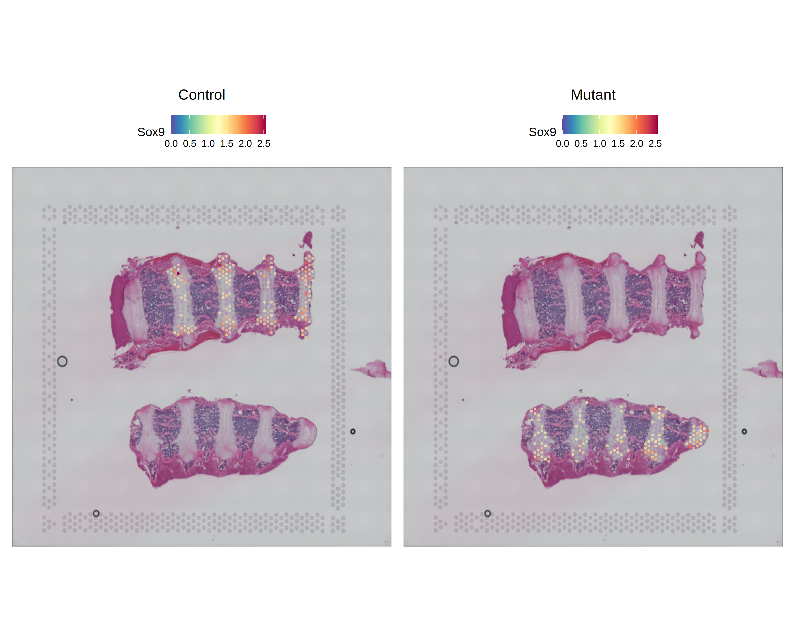<!-- -->

alt=“Spatial Feature plot of Sox9 expression split by condition” /\>
split by condition
</figcaption>

``` r
# Plot the expression of Sox9 on UMAP
figure_c<-FeaturePlot(
  object = combined,
  features = "Sox9",split.by = "condition",
  reduction = "umap",
  ncol = 3,
  pt.size = 3,
  order = TRUE,
  min.cutoff = "q10",
  max.cutoff = "q90",
)+ theme(axis.text = element_text(family = "Arial", size = 12))
figure_c
```

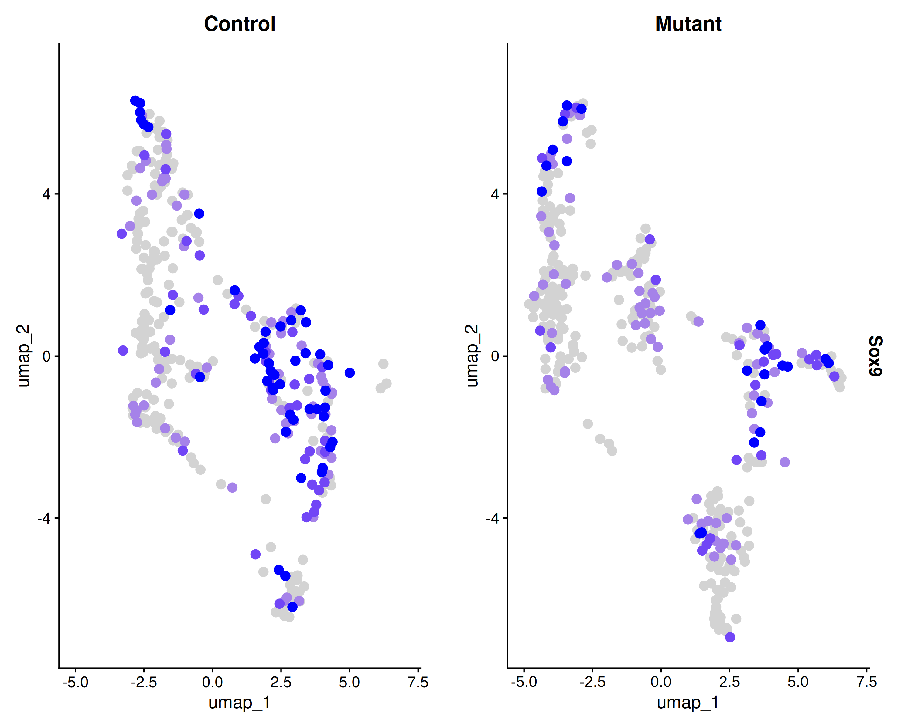<!-- -->

alt=“Spatial Feature plot of Sox9 expression split by condition” /\>
split by condition
</figcaption>

``` r
ggsave(
  filename = "figure_c_Sox9_DimPlot.png",
  plot = figure_c,
  width = 20,  # Make the width larger
  height = 8,  # Make the height smaller
  dpi = 300
)
wrap_plots(B = figure_e, A = figure_c, design = "BB
           AA")
```

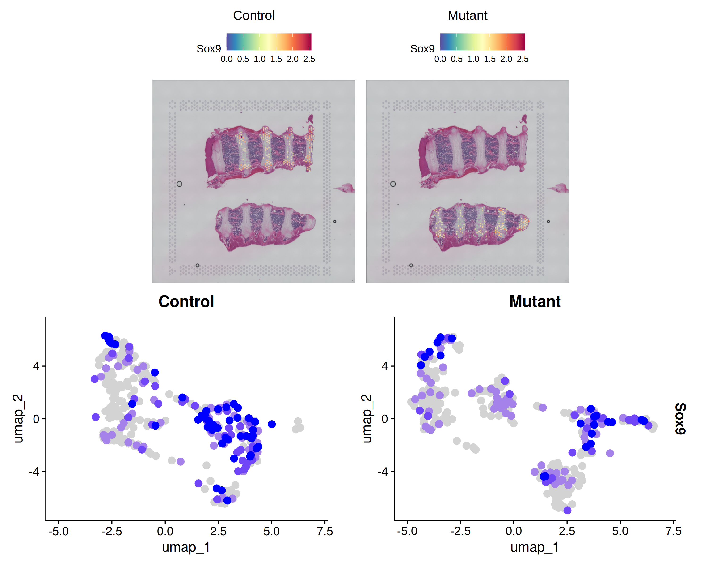<!-- -->

alt=“Spatial Feature plot of Sox9 expression split by condition” /\>
split by condition
</figcaption>

## Sox9 Expression in Different Clusters

``` r
# Extract "Sox9" expression from the SCT assay
Sox9.control <- GetAssayData(combined, assay = "SCT", slot = "data")["Sox9", ] * (combined$condition == "Control")
Sox9.mutant  <- GetAssayData(combined, assay = "SCT", slot = "data")["Sox9", ] * (combined$condition == "Mutant")

# Combine into a new matrix with fake gene names
new_expr <- rbind("Control" = Sox9.control, "Mutant" = Sox9.mutant)

# Create a new assay from this matrix
combined[["Sox9_split"]] <- CreateAssayObject(data = new_expr)
DefaultAssay(combined) <- "Sox9_split"

previous_idents <- Idents(combined)

Idents(combined) <- "seurat_clusters"
combined$seurat_clusters <- factor(combined$seurat_clusters)

# Plot the "split" expression as separate genes
figure_d<-DotPlot(
  combined,
  features = c("Control", "Mutant"),
  group.by = "seurat_clusters",
  dot.scale = 10
) +
  RotatedAxis() +
  theme(text = element_text(size = 20))    + theme(axis.title.x = element_blank(), axis.title.y = element_blank())+ 
  theme(text = element_text(size = 20))
figure_d
```

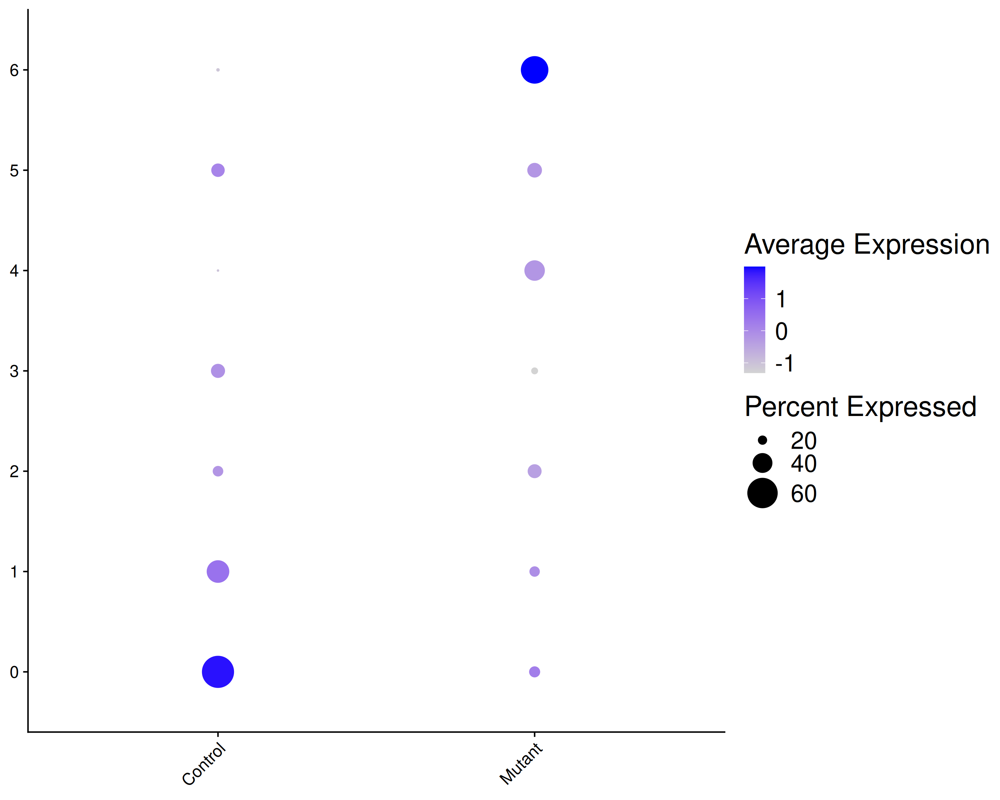<!-- -->

alt=“Sox9 expression analysis across cell types and conditions” /\>
types and conditions
</figcaption>

``` r
ggsave(
  filename = "figure_d_Sox9_DotPlot.png",
  plot = figure_d,
  width = 10,  # Make the width larger
  height = 10,  # Make the height smaller
  dpi = 300
)
Idents(combined) <- previous_idents
DefaultAssay(combined) <- "SCT"
```

## UCP1 & UCP2 Expression Visualization

``` r
figure_u<-SpatialFeaturePlot(
  combined,
  features = c("Ucp1"),
  pt.size = 1.5,
  ncol = 2,
  crop = FALSE,
  alpha = c(0.15, 1)  # dim H&E image, keep expression spots bright
)
figure_u
```

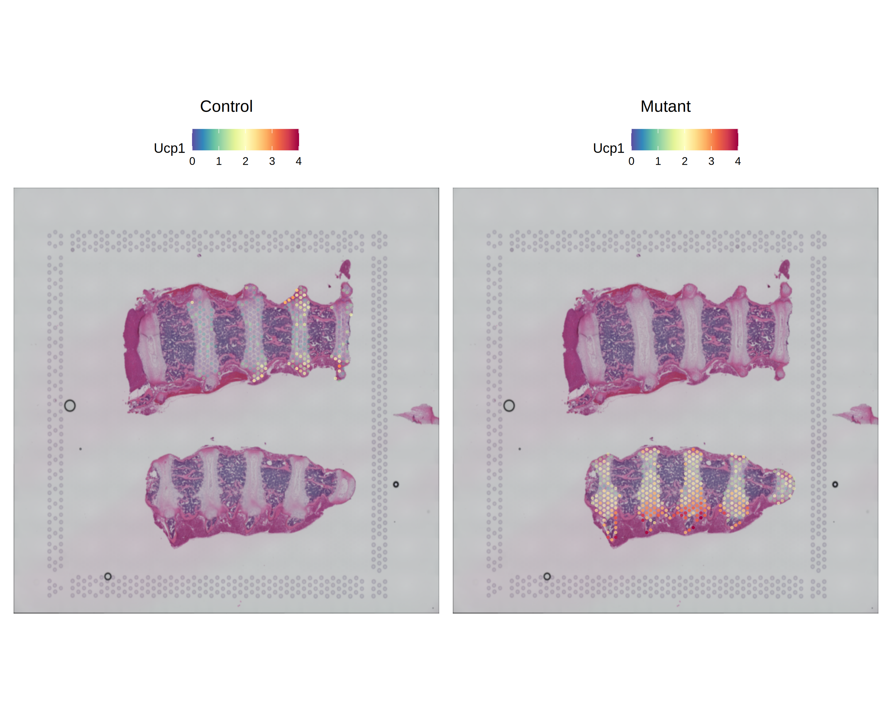<!-- -->

alt=“Feature plot of Sox9 expression split by condition” /\> condition
</figcaption>

``` r
figure_u2<-SpatialFeaturePlot(
  combined,
  features = c("Ucp2"),
  pt.size = 1.5,
  ncol = 2,
  crop = FALSE,
  alpha = c(0.15, 1)  # dim H&E image, keep expression spots bright
)
figure_u2
```

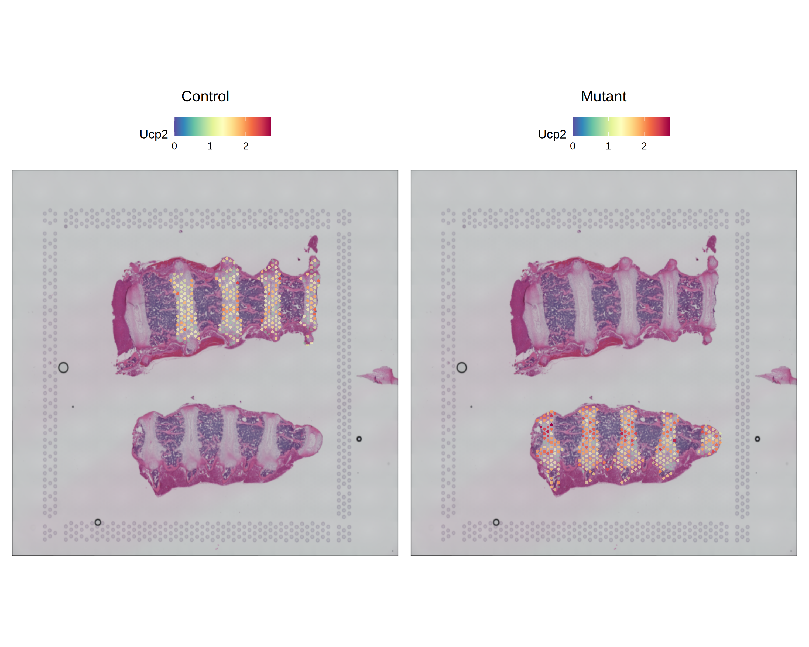<!-- -->

alt=“Feature plot of Sox9 expression split by condition” /\> condition
</figcaption>

# Pulposus marker genes expression in tissue

We focus on Nucleus Pulposus marker genes expression in Mutant vs
Control.

## Krt19, T, Arhgef16, Lyst, Tmem255a Expression in Tissue

``` r
NPgenes <- c("Krt19", "T", "Arhgef16", "Lyst", "Tmem255a")

expr_mat <- FetchData(combined, vars = NPgenes, slot = "data")

global_min <- 0
global_max <- 2
Layers(combined[["Spatial"]])
```

    ## [1] "counts.1" "counts.2"

``` r
DefaultAssay(combined)
```

    ## [1] "SCT"

``` r
figure_Krt19<-SpatialFeaturePlot(
  combined,
  features = c("Krt19"),
  pt.size = 1.5,
  ncol = 2,
  crop = FALSE,
  image.alpha=0.5,
  min.cutoff = global_min,
  max.cutoff = global_max# dim H&E image, keep expression spots bright
)
figure_Krt19
```

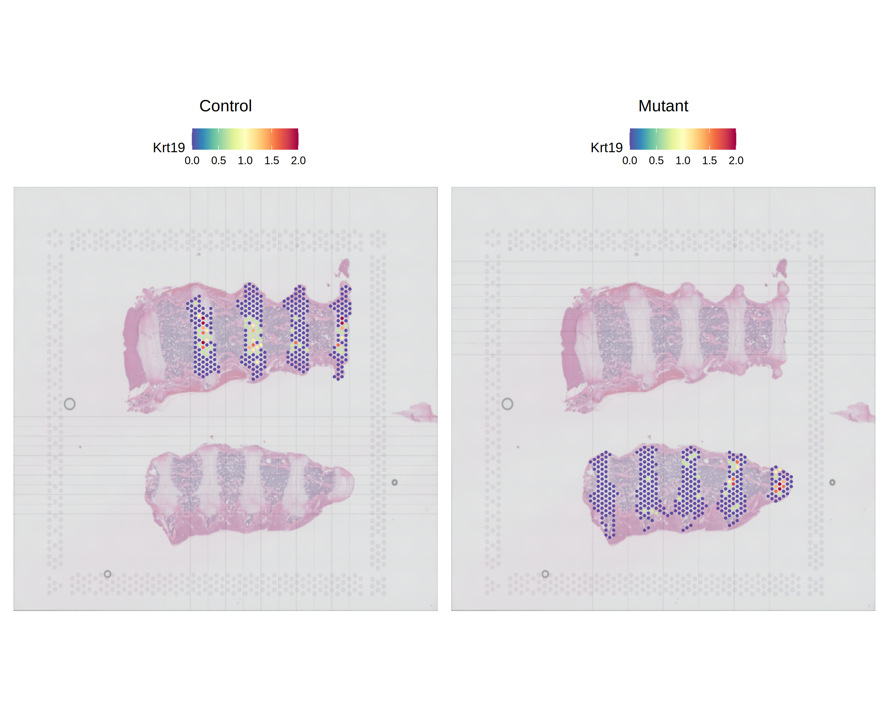<!-- -->

alt=“Spatial Feature plot of Sox9 expression split by condition” /\>
split by condition
</figcaption>

``` r
figure_T<-SpatialFeaturePlot(
  combined,
  features = c("T"),
  pt.size = 1.5,
  ncol = 2,
  crop = FALSE,
  image.alpha=0.5,
  min.cutoff = global_min,
  max.cutoff = global_max# dim H&E image, keep expression spots bright
)
figure_T
```

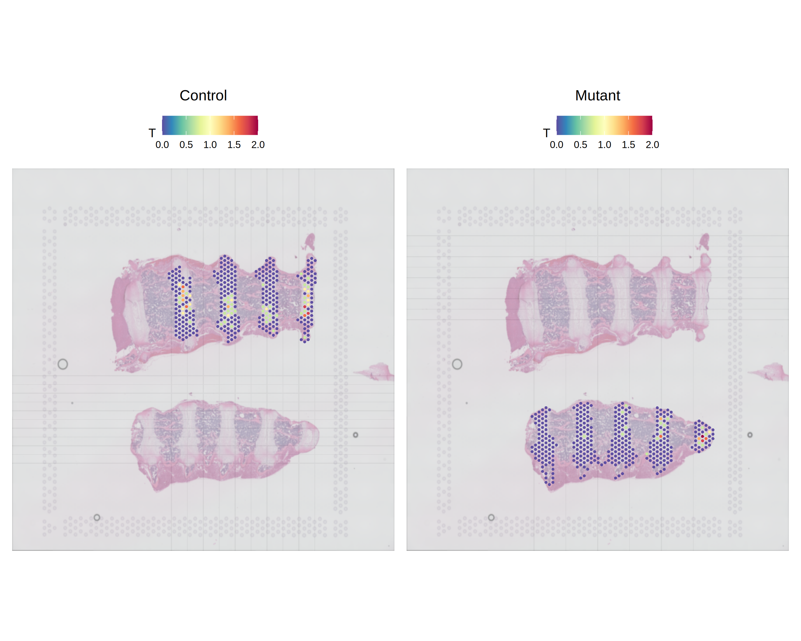<!-- -->

alt=“Spatial Feature plot of Sox9 expression split by condition” /\>
split by condition
</figcaption>

``` r
figure_Arhgef16<-SpatialFeaturePlot(
  combined,
  features = c("Arhgef16"),
  pt.size = 1.5,
  ncol = 2,
  crop = FALSE,
  image.alpha=0.5,
  min.cutoff = global_min,
  max.cutoff = global_max# dim H&E image, keep expression spots bright
)
figure_Arhgef16
```

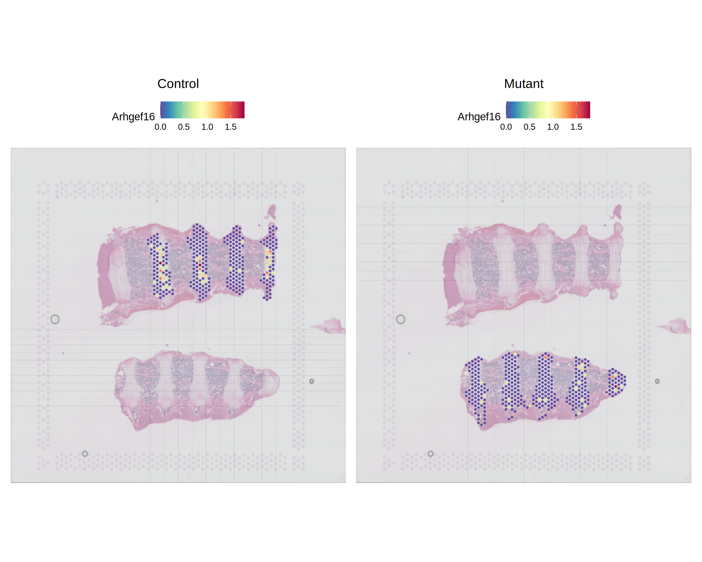<!-- -->

alt=“Spatial Feature plot of Sox9 expression split by condition” /\>
split by condition
</figcaption>

``` r
figure_Lyst<-SpatialFeaturePlot(
  combined,
  features = c("Lyst"),
  pt.size = 1.5,
  ncol = 2,
  crop = FALSE,
  image.alpha=0.5,min.cutoff = global_min,
  max.cutoff = global_max  # dim H&E image, keep expression spots bright
)
figure_Lyst
```

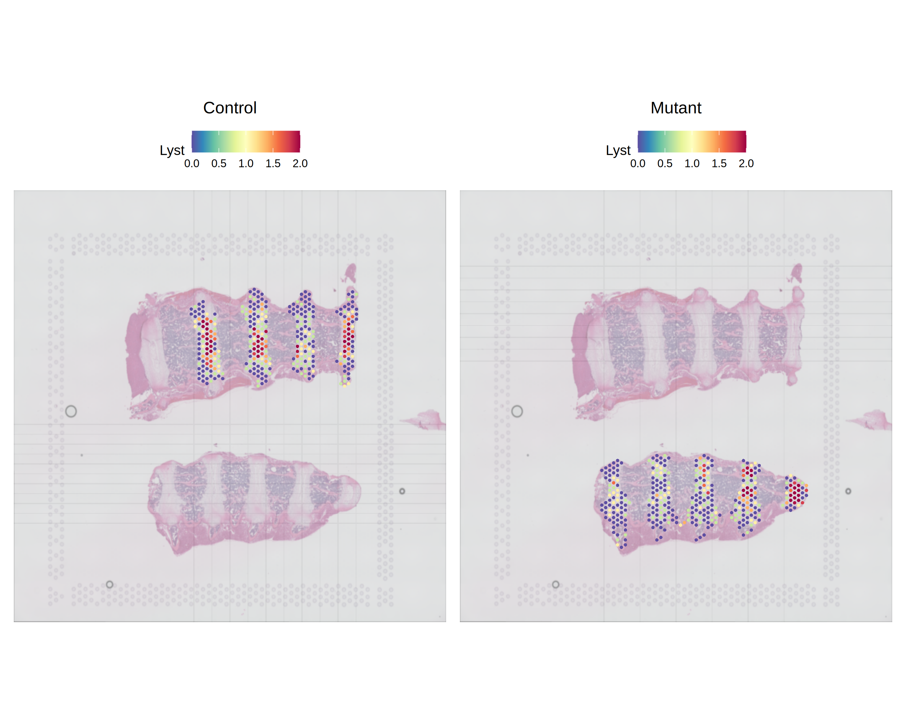<!-- -->

alt=“Spatial Feature plot of Sox9 expression split by condition” /\>
split by condition
</figcaption>

``` r
figure_Tmem255a<-SpatialFeaturePlot(
  combined,
  features = c("Tmem255a"),
  pt.size = 1.5,
  ncol = 2,
  crop = FALSE,
  image.alpha=0.5,min.cutoff = global_min,
  max.cutoff = global_max  # dim H&E image, keep expression spots bright
)
figure_Tmem255a
```

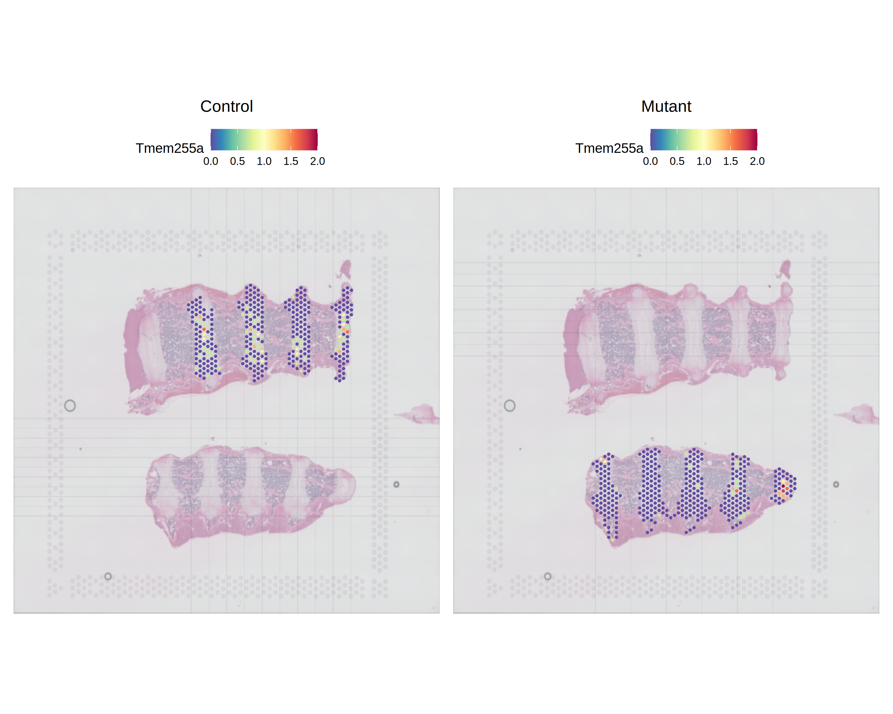<!-- -->

alt=“Spatial Feature plot of Sox9 expression split by condition” /\>
split by condition
</figcaption>

``` r
#To be biologically meaningful to see the actual expression, we need to normalize the dataset and use ln expression values. 

combinedNormalize <- NormalizeData(
  combined,
  assay = "Spatial",
  normalization.method = "LogNormalize",
  scale.factor = 10000
)

Layers(combinedNormalize[["Spatial"]])
```

    ## [1] "counts.1" "counts.2" "data.1"   "data.2"

``` r
summary(GetAssayData(combinedNormalize[["Spatial"]], layer = "data.1")["Krt19", ])
```

    ##    Min. 1st Qu.  Median    Mean 3rd Qu.    Max. 
    ##  0.0000  0.0000  0.0000  0.1095  0.0000  2.4706

``` r
summary(GetAssayData(combinedNormalize[["Spatial"]], layer = "data.2")["Krt19", ])
```

    ##    Min. 1st Qu.  Median    Mean 3rd Qu.    Max. 
    ##  0.0000  0.0000  0.0000  0.2384  0.0000  2.6422

``` r
DefaultAssay(combinedNormalize) <- "Spatial"

figure_Krt19<-SpatialFeaturePlot(
  combinedNormalize,
  features = c("Krt19"),
  pt.size = 1.5,
  ncol = 2,
  crop = FALSE,
  image.alpha=0.5,
  min.cutoff = global_min,
  max.cutoff = global_max# dim H&E image, keep expression spots bright
)
figure_Krt19
```

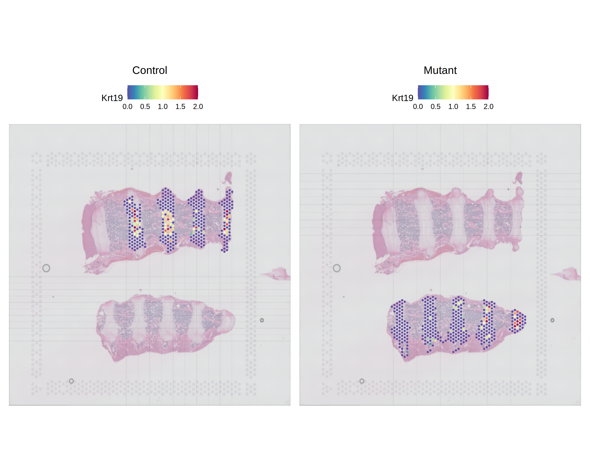<!-- -->

alt=“Spatial Feature plot of Sox9 expression split by condition” /\>
split by condition
</figcaption>

``` r
figure_T<-SpatialFeaturePlot(
  combinedNormalize,
  features = c("T"),
  pt.size = 1.5,
  ncol = 2,
  crop = FALSE,
  image.alpha=0.5,
  min.cutoff = global_min,
  max.cutoff = global_max# dim H&E image, keep expression spots bright
)
figure_T
```

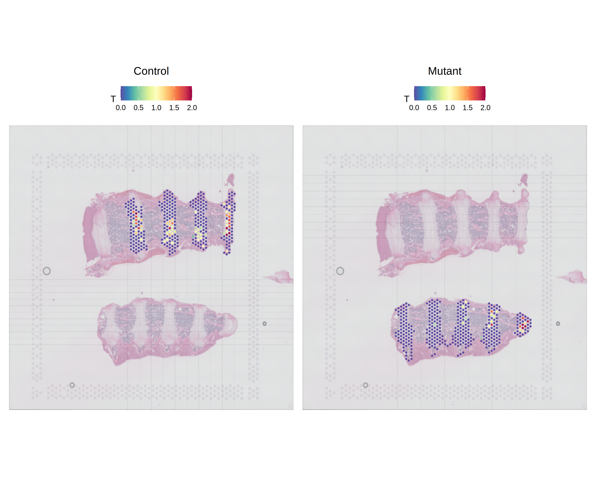<!-- -->

alt=“Spatial Feature plot of Sox9 expression split by condition” /\>
split by condition
</figcaption>

``` r
figure_Arhgef16<-SpatialFeaturePlot(
  combinedNormalize,
  features = c("Arhgef16"),
  pt.size = 1.5,
  ncol = 2,
  crop = FALSE,
  image.alpha=0.5,
  min.cutoff = global_min,
  max.cutoff = global_max# dim H&E image, keep expression spots bright
)
figure_Arhgef16
```

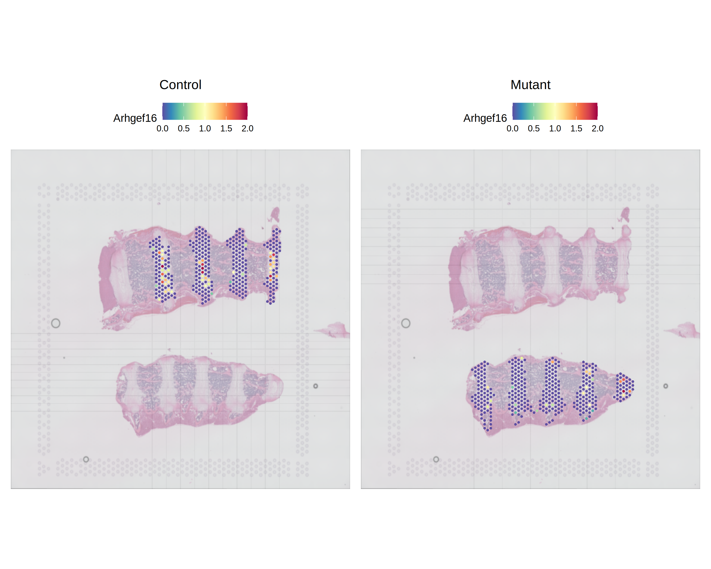<!-- -->

alt=“Spatial Feature plot of Sox9 expression split by condition” /\>
split by condition
</figcaption>

``` r
figure_Lyst<-SpatialFeaturePlot(
  combinedNormalize,
  features = c("Lyst"),
  pt.size = 1.5,
  ncol = 2,
  crop = FALSE,
  image.alpha=0.5,min.cutoff = global_min,
  max.cutoff = global_max  # dim H&E image, keep expression spots bright
)
figure_Lyst
```

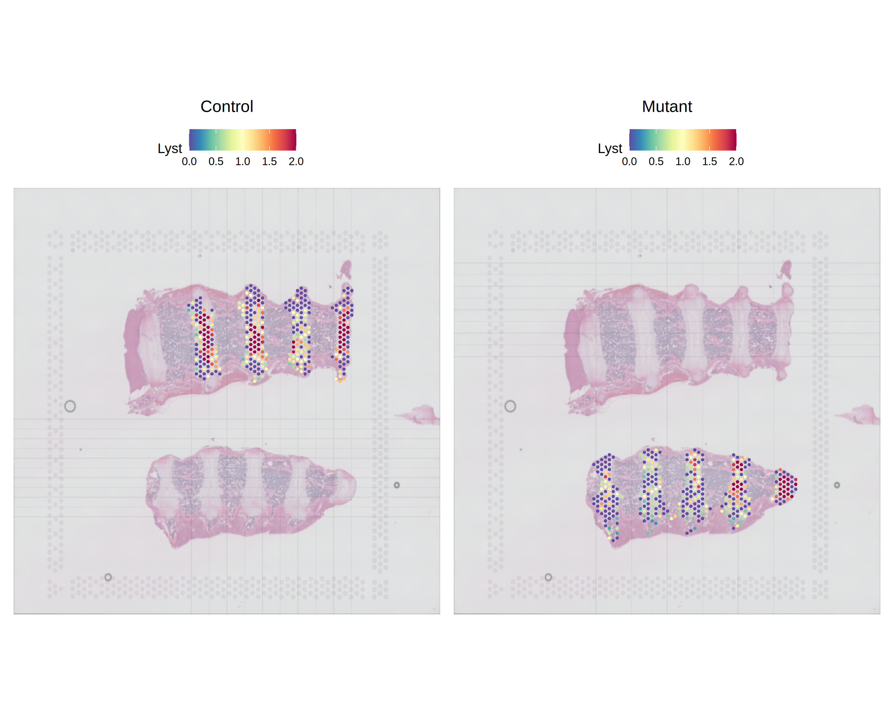<!-- -->

alt=“Spatial Feature plot of Sox9 expression split by condition” /\>
split by condition
</figcaption>

``` r
figure_Tmem255a<-SpatialFeaturePlot(
  combinedNormalize,
  features = c("Tmem255a"),
  pt.size = 1.5,
  ncol = 2,
  crop = FALSE,
  image.alpha=0.5,min.cutoff = global_min,
  max.cutoff = global_max  # dim H&E image, keep expression spots bright
)
figure_Tmem255a
```

<!-- -->

alt=“Spatial Feature plot of Sox9 expression split by condition” /\>
split by condition
</figcaption>

# Cartilage and ECM Marker Genes Expression in Tissue

We focus on cartilage and ECM marker genes expression in Mutant vs
Control.

## Acan, Col9a1, Col2a1, Comp, Matn3, Sox9, Col11a2, Col27a1 Expression in Tissue

``` r
# Genes of interest
cartilage_genes <- c("Acan", "Col9a1", "Col2a1", "Comp", "Matn3", "Sox9", "Col11a2", "Col27a1")

# We reuse the combinedNormalize object from the previous section
# ensuring we are using the LogNormalized data
DefaultAssay(combinedNormalize) <- "Spatial"

global_min <- 0
global_max <- 2  # Keeping consistent with previous section

# Acan
figure_Acan <- SpatialFeaturePlot(
  combinedNormalize,
  features = c("Acan"),
  pt.size = 1.5,
  ncol = 2,
  crop = FALSE,
  image.alpha = 0.5,
  min.cutoff = global_min,
  max.cutoff = global_max
)
figure_Acan
```

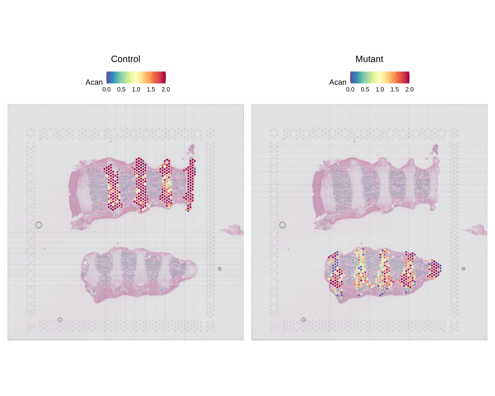<!-- -->

alt=“Spatial Feature plot of Cartilage/ECM genes split by condition” /\>
genes split by condition
</figcaption>

``` r
# Col9a1
figure_Col9a1 <- SpatialFeaturePlot(
  combinedNormalize,
  features = c("Col9a1"),
  pt.size = 1.5,
  ncol = 2,
  crop = FALSE,
  image.alpha = 0.5,
  min.cutoff = global_min,
  max.cutoff = global_max
)
figure_Col9a1
```

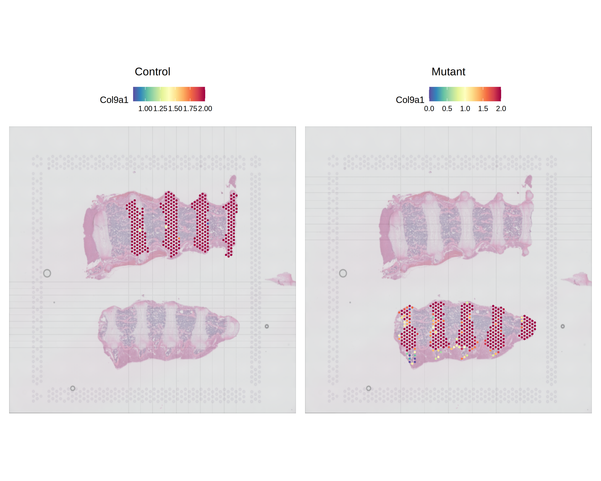<!-- -->

alt=“Spatial Feature plot of Cartilage/ECM genes split by condition” /\>
genes split by condition
</figcaption>

``` r
# Col2a1
figure_Col2a1 <- SpatialFeaturePlot(
  combinedNormalize,
  features = c("Col2a1"),
  pt.size = 1.5,
  ncol = 2,
  crop = FALSE,
  image.alpha = 0.5,
  min.cutoff = global_min,
  max.cutoff = global_max
)
figure_Col2a1
```

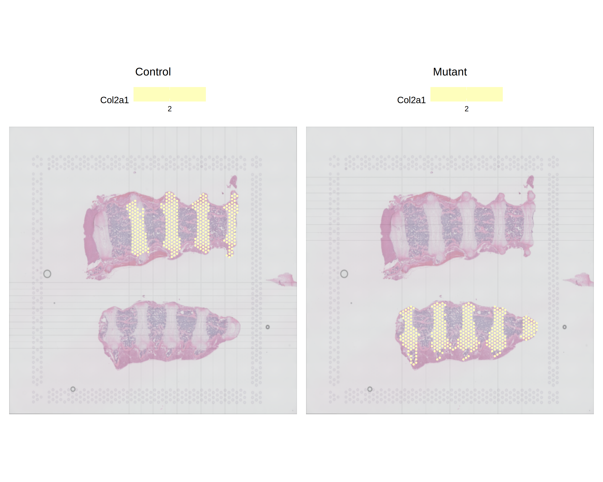<!-- -->

alt=“Spatial Feature plot of Cartilage/ECM genes split by condition” /\>
genes split by condition
</figcaption>

``` r
# Comp
figure_Comp <- SpatialFeaturePlot(
  combinedNormalize,
  features = c("Comp"),
  pt.size = 1.5,
  ncol = 2,
  crop = FALSE,
  image.alpha = 0.5,
  min.cutoff = global_min,
  max.cutoff = global_max
)
figure_Comp
```

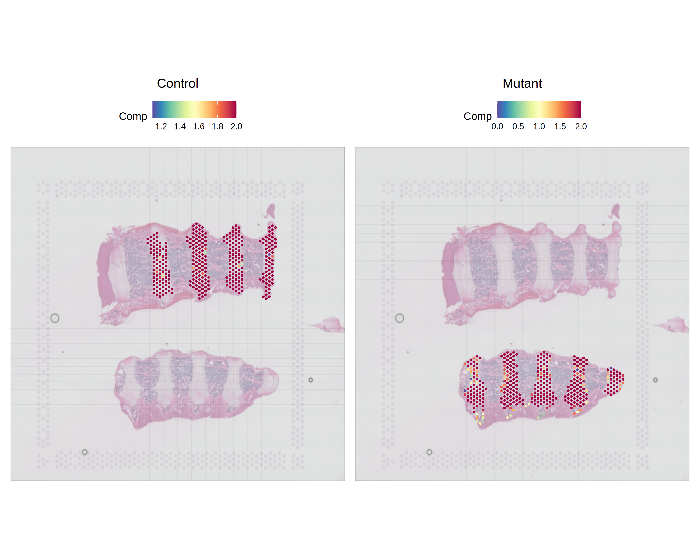<!-- -->

alt=“Spatial Feature plot of Cartilage/ECM genes split by condition” /\>
genes split by condition
</figcaption>

``` r
# Matn3
figure_Matn3 <- SpatialFeaturePlot(
  combinedNormalize,
  features = c("Matn3"),
  pt.size = 1.5,
  ncol = 2,
  crop = FALSE,
  image.alpha = 0.5,
  min.cutoff = global_min,
  max.cutoff = global_max
)
figure_Matn3
```

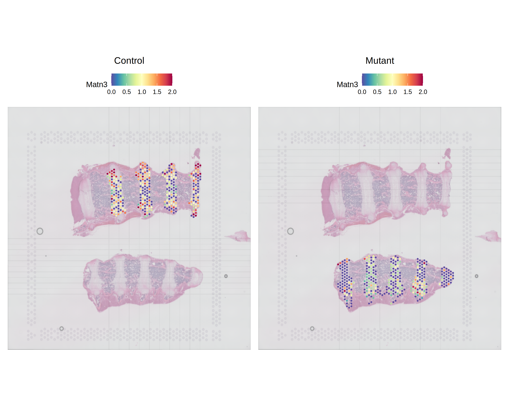<!-- -->

alt=“Spatial Feature plot of Cartilage/ECM genes split by condition” /\>
genes split by condition
</figcaption>

``` r
# Sox9
figure_Sox9 <- SpatialFeaturePlot(
  combinedNormalize,
  features = c("Sox9"),
  pt.size = 1.5,
  ncol = 2,
  crop = FALSE,
  image.alpha = 0.5,
  min.cutoff = global_min,
  max.cutoff = global_max
)
figure_Sox9
```

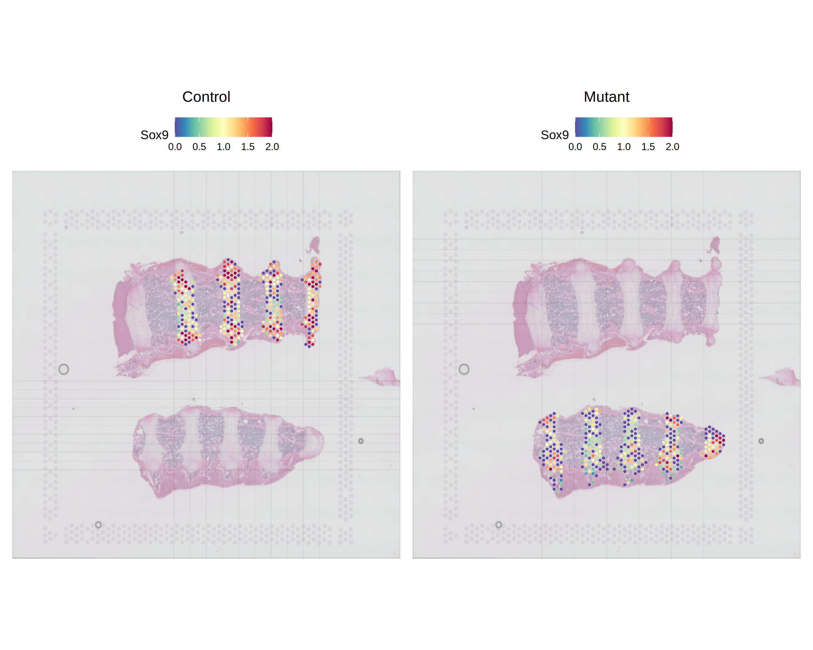<!-- -->

alt=“Spatial Feature plot of Cartilage/ECM genes split by condition” /\>
genes split by condition
</figcaption>

``` r
# Col11a2
figure_Col11a2 <- SpatialFeaturePlot(
  combinedNormalize,
  features = c("Col11a2"),
  pt.size = 1.5,
  ncol = 2,
  crop = FALSE,
  image.alpha = 0.5,
  min.cutoff = global_min,
  max.cutoff = global_max
)
figure_Col11a2
```

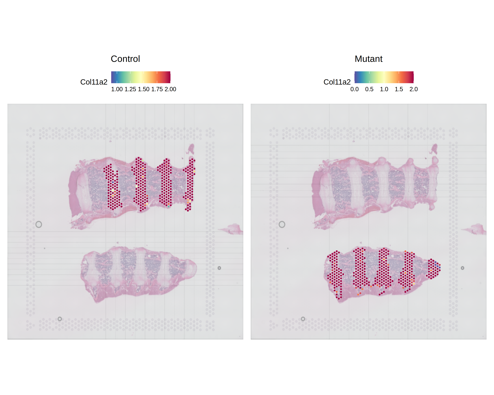<!-- -->

alt=“Spatial Feature plot of Cartilage/ECM genes split by condition” /\>
genes split by condition
</figcaption>

``` r
# Col27a1
figure_Col27a1 <- SpatialFeaturePlot(
  combinedNormalize,
  features = c("Col27a1"),
  pt.size = 1.5,
  ncol = 2,
  crop = FALSE,
  image.alpha = 0.5,
  min.cutoff = global_min,
  max.cutoff = global_max
)
figure_Col27a1
```

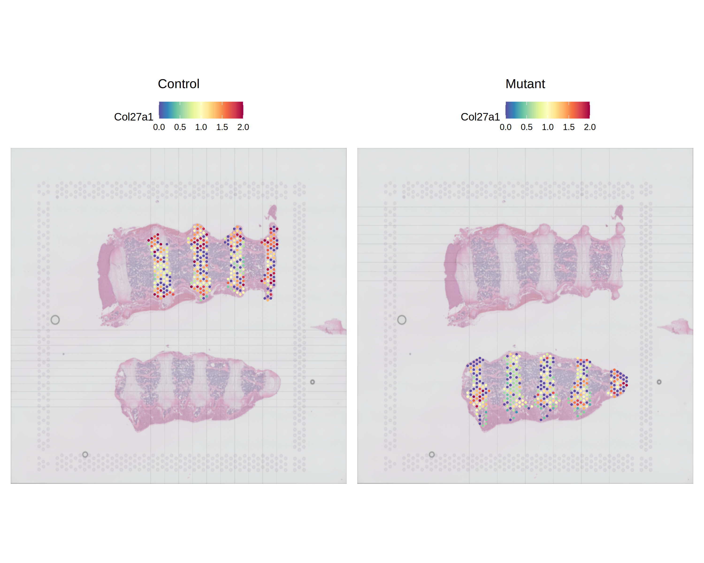<!-- -->

alt=“Spatial Feature plot of Cartilage/ECM genes split by condition” /\>
genes split by condition
</figcaption>

# GO Enrichment Analysis

This section validates the findings by running GO analysis on the
“Muscle-Score Filtered” dataset (Strategy 4). This dataset was cleaned
by removing high-muscle spots mathematically, without manually selecting
clusters. If the upregulation of cartilage genes is robust, it should
appear here as well.

## Prepare Gene Lists for GO Analysis

``` r
# 1. Get the list of significant up- and down-regulated genes (using gene symbols)
# We'll use the de_df data frame created in the volcano plot chunk
sig_up_genes <- de_df %>% 
  filter(significance == "Up in Mutant") %>%
  pull(gene)

sig_down_genes <- de_df %>%
  filter(significance == "Down in Mutant") %>%
  pull(gene)

# 2. Define the "universe" of all genes that were tested
# Use the 'gene' column since de_df is now a tibble with explicit gene names
universe_genes <- de_df$gene

# Ensure genes are characters and remove NA or empty strings
universe_genes <- as.character(universe_genes)
universe_genes <- universe_genes[universe_genes != ""]

# Check if we have genes to map
if (length(universe_genes) == 0) {
  stop("No genes found in de_df$gene for universe definition.")
}

# 3. Convert gene symbols to Entrez IDs
# We use the bitr function for conversion
# Use tryCatch to handle potential mapping failures gracefully
ids_up <- tryCatch(
  bitr(sig_up_genes, fromType = "SYMBOL", toType = "ENTREZID", OrgDb = org.Mm.eg.db),
  error = function(e) { message("Error mapping UP genes: ", e$message); return(data.frame(SYMBOL=character(), ENTREZID=character())) }
)

ids_down <- tryCatch(
  bitr(sig_down_genes, fromType = "SYMBOL", toType = "ENTREZID", OrgDb = org.Mm.eg.db),
  error = function(e) { message("Error mapping DOWN genes: ", e$message); return(data.frame(SYMBOL=character(), ENTREZID=character())) }
)

ids_universe <- tryCatch(
  bitr(universe_genes, fromType = "SYMBOL", toType = "ENTREZID", OrgDb = org.Mm.eg.db),
  error = function(e) { message("Error mapping Universe genes: ", e$message); return(data.frame(SYMBOL=character(), ENTREZID=character())) }
)

cat("Up-regulated genes: ", length(sig_up_genes), " symbols mapped to ", nrow(ids_up), " Entrez IDs.\n")
```

    ## Up-regulated genes:  273  symbols mapped to  268  Entrez IDs.

``` r
cat("Down-regulated genes: ", length(sig_down_genes), " symbols mapped to ", nrow(ids_down), " Entrez IDs.\n")
```

    ## Down-regulated genes:  125  symbols mapped to  125  Entrez IDs.

``` r
cat("Universe genes: ", length(universe_genes), " symbols mapped to ", nrow(ids_universe), " Entrez IDs.\n")
```

    ## Universe genes:  4077  symbols mapped to  3994  Entrez IDs.

## Run Over-Representation Analysis (ORA)

``` r
# Run GO enrichment for UP-regulated genes
ego_up <- enrichGO(gene          = ids_up$ENTREZID,
                   universe      = ids_universe$ENTREZID,
                   OrgDb         = org.Mm.eg.db,
                   ont           = "BP", # BP, CC, MF, or ALL
                   pAdjustMethod = "BH",
                   pvalueCutoff  = 0.8, # Relaxed to capture borderline terms
                   qvalueCutoff  = 0.8, # Relaxed
                   readable      = TRUE) # This will map Entrez IDs back to symbols in the results

# Run GO enrichment for DOWN-regulated genes
ego_down <- enrichGO(gene        = ids_down$ENTREZID,
                     universe      = ids_universe$ENTREZID,
                     OrgDb         = org.Mm.eg.db,
                     ont           = "BP",
                     pAdjustMethod = "BH",
                     pvalueCutoff  = 0.8, # Relaxed
                     qvalueCutoff  = 0.8, # Relaxed
                     readable      = TRUE)

# View results as a data frame
cat("\nTop GO terms for UP-regulated genes in Mutant:\n")
```

    ## 
    ## Top GO terms for UP-regulated genes in Mutant:

``` r
print(head(as.data.frame(ego_up)))
```

    ##                    ID                           Description GeneRatio  BgRatio
    ## GO:0019752 GO:0019752     carboxylic acid metabolic process    91/263 287/3892
    ## GO:0043436 GO:0043436             oxoacid metabolic process    91/263 293/3892
    ## GO:0006082 GO:0006082        organic acid metabolic process    91/263 294/3892
    ## GO:0032787 GO:0032787 monocarboxylic acid metabolic process    69/263 214/3892
    ## GO:0006631 GO:0006631          fatty acid metabolic process    57/263 156/3892
    ## GO:0045333 GO:0045333                  cellular respiration    46/263 104/3892
    ##                  pvalue     p.adjust       qvalue
    ## GO:0019752 6.673810e-42 1.725847e-38 1.547621e-38
    ## GO:0043436 4.762559e-41 5.665153e-38 5.080121e-38
    ## GO:0006082 6.572104e-41 5.665153e-38 5.080121e-38
    ## GO:0032787 1.443308e-31 9.330986e-29 8.367388e-29
    ## GO:0006631 3.668270e-29 1.897229e-26 1.701305e-26
    ## GO:0045333 8.499111e-28 3.605204e-25 3.232900e-25
    ##                                                                                                                                                                                                                                                                                                                                                                                                                                                                                                                                                geneID
    ## GO:0019752 Fabp4/Gpd1/Acaa2/Aco2/Eci1/Apoc1/Etfb/Acadvl/Lpl/Acadl/Acadm/Dgat2/Lipe/Adipoq/Idh3b/Sdhb/Bckdha/Pck1/Hadh/Ech1/Idh3a/Mecr/Idh3g/Ephx2/Mdh1/Suclg1/Decr1/Idh2/Cdo1/Etfdh/Acads/Clstn3/Sucla2/Pdha1/Dbi/Ogdh/Echs1/Slc4a4/Acacb/Dld/Ppara/Cs/Scd1/Crat/Pdk4/Dlst/Ces1d/Etfa/Cpt1b/Hadha/Mdh2/Acsl1/Gpam/C3/Hadhb/Cpt2/Prkar2b/Acsm3/Plin5/Dlat/Acat1/Gpi1/Pparg/Acly/Pcx/Acad11/Fh1/Mgll/Pdk2/Pgam1/Adipor2/Bckdhb/Aco1/Aldh4a1/Sdha/Aldoa/Ndufab1/Dpep1/Slc27a1/Cyp27a1/Aldh6a1/Acot8/Hk2/Fasn/Elovl1/Ptges2/Acaa1b/Dbt/Fabp3/Acox1/Ehhadh
    ## GO:0043436 Fabp4/Gpd1/Acaa2/Aco2/Eci1/Apoc1/Etfb/Acadvl/Lpl/Acadl/Acadm/Dgat2/Lipe/Adipoq/Idh3b/Sdhb/Bckdha/Pck1/Hadh/Ech1/Idh3a/Mecr/Idh3g/Ephx2/Mdh1/Suclg1/Decr1/Idh2/Cdo1/Etfdh/Acads/Clstn3/Sucla2/Pdha1/Dbi/Ogdh/Echs1/Slc4a4/Acacb/Dld/Ppara/Cs/Scd1/Crat/Pdk4/Dlst/Ces1d/Etfa/Cpt1b/Hadha/Mdh2/Acsl1/Gpam/C3/Hadhb/Cpt2/Prkar2b/Acsm3/Plin5/Dlat/Acat1/Gpi1/Pparg/Acly/Pcx/Acad11/Fh1/Mgll/Pdk2/Pgam1/Adipor2/Bckdhb/Aco1/Aldh4a1/Sdha/Aldoa/Ndufab1/Dpep1/Slc27a1/Cyp27a1/Aldh6a1/Acot8/Hk2/Fasn/Elovl1/Ptges2/Acaa1b/Dbt/Fabp3/Acox1/Ehhadh
    ## GO:0006082 Fabp4/Gpd1/Acaa2/Aco2/Eci1/Apoc1/Etfb/Acadvl/Lpl/Acadl/Acadm/Dgat2/Lipe/Adipoq/Idh3b/Sdhb/Bckdha/Pck1/Hadh/Ech1/Idh3a/Mecr/Idh3g/Ephx2/Mdh1/Suclg1/Decr1/Idh2/Cdo1/Etfdh/Acads/Clstn3/Sucla2/Pdha1/Dbi/Ogdh/Echs1/Slc4a4/Acacb/Dld/Ppara/Cs/Scd1/Crat/Pdk4/Dlst/Ces1d/Etfa/Cpt1b/Hadha/Mdh2/Acsl1/Gpam/C3/Hadhb/Cpt2/Prkar2b/Acsm3/Plin5/Dlat/Acat1/Gpi1/Pparg/Acly/Pcx/Acad11/Fh1/Mgll/Pdk2/Pgam1/Adipor2/Bckdhb/Aco1/Aldh4a1/Sdha/Aldoa/Ndufab1/Dpep1/Slc27a1/Cyp27a1/Aldh6a1/Acot8/Hk2/Fasn/Elovl1/Ptges2/Acaa1b/Dbt/Fabp3/Acox1/Ehhadh
    ## GO:0032787                                                                                                                               Fabp4/Gpd1/Acaa2/Eci1/Apoc1/Etfb/Acadvl/Lpl/Acadl/Acadm/Dgat2/Lipe/Adipoq/Pck1/Hadh/Ech1/Mecr/Ephx2/Decr1/Idh2/Etfdh/Acads/Pdha1/Dbi/Ogdh/Echs1/Slc4a4/Acacb/Dld/Ppara/Scd1/Crat/Pdk4/Ces1d/Etfa/Cpt1b/Hadha/Acsl1/Gpam/C3/Hadhb/Cpt2/Prkar2b/Acsm3/Plin5/Dlat/Acat1/Gpi1/Pparg/Acly/Pcx/Acad11/Mgll/Pdk2/Pgam1/Adipor2/Aldoa/Ndufab1/Slc27a1/Cyp27a1/Acot8/Hk2/Fasn/Elovl1/Ptges2/Acaa1b/Fabp3/Acox1/Ehhadh
    ## GO:0006631                                                                                                                                                                                                 Fabp4/Acaa2/Eci1/Apoc1/Etfb/Acadvl/Lpl/Acadl/Acadm/Dgat2/Lipe/Adipoq/Pck1/Hadh/Ech1/Mecr/Ephx2/Decr1/Etfdh/Acads/Dbi/Echs1/Acacb/Dld/Ppara/Scd1/Crat/Pdk4/Ces1d/Etfa/Cpt1b/Hadha/Acsl1/Gpam/C3/Hadhb/Cpt2/Prkar2b/Acsm3/Plin5/Acat1/Pparg/Acly/Acad11/Mgll/Pdk2/Adipor2/Ndufab1/Slc27a1/Acot8/Fasn/Elovl1/Ptges2/Acaa1b/Fabp3/Acox1/Ehhadh
    ## GO:0045333                                                                                                                                                                                                                                                             Gpd1/Cox8b/Aco2/Etfb/Cox6a1/Uqcrfs1/Cox7a1/Idh3b/Sdhb/Cox5b/Uqcrc1/Idh3a/Idh3g/Mdh1/Suclg1/Idh2/Sucla2/Pdha1/Ogdh/Sod2/Uqcr11/Dld/Cs/Ndufv1/Cyc1/Dlst/Cox7b/Etfa/Sdhc/Uqcr10/Mdh2/Ndufs7/Ndufs8/Dlat/Chchd10/Acly/Cox8a/Fh1/Ndufa10/Ndufb6/Aco1/Sdha/Ndufab1/Cat/Ndufb8/Ndufb9
    ##            Count
    ## GO:0019752    91
    ## GO:0043436    91
    ## GO:0006082    91
    ## GO:0032787    69
    ## GO:0006631    57
    ## GO:0045333    46

``` r
cat("\nTop GO terms for DOWN-regulated genes in Mutant:\n")
```

    ## 
    ## Top GO terms for DOWN-regulated genes in Mutant:

``` r
print(head(as.data.frame(ego_down)))
```

    ##                    ID                      Description GeneRatio  BgRatio
    ## GO:0006936 GO:0006936               muscle contraction    31/120 102/3892
    ## GO:0003012 GO:0003012            muscle system process    35/120 140/3892
    ## GO:0030239 GO:0030239               myofibril assembly    20/120  33/3892
    ## GO:0055002 GO:0055002 striated muscle cell development    20/120  33/3892
    ## GO:0055001 GO:0055001          muscle cell development    26/120  88/3892
    ## GO:0061061 GO:0061061     muscle structure development    39/120 237/3892
    ##                  pvalue     p.adjust       qvalue
    ## GO:0006936 6.317774e-24 6.567150e-21 5.719326e-21
    ## GO:0003012 7.362276e-24 6.567150e-21 5.719326e-21
    ## GO:0030239 4.905524e-23 2.187864e-20 1.905409e-20
    ## GO:0055002 4.905524e-23 2.187864e-20 1.905409e-20
    ## GO:0055001 1.007953e-19 3.596376e-17 3.132081e-17
    ## GO:0061061 1.484083e-19 4.412674e-17 3.842995e-17
    ##                                                                                                                                                                                                                              geneID
    ## GO:0006936                                              Myh2/Tnnc2/Tnnt3/Myh1/Mylpf/Atp2a1/Myl1/Tcap/Myh7/Ttn/Tpm2/Ryr1/Comp/Actn2/Tpm1/Csrp3/Tnni2/Tnnt1/Casq1/Tnni1/Mybpc1/Lmod2/Myl2/Tnnc1/Actn3/Pgam2/Jsrp1/Myh3/Myom2/Myl3/Gsn
    ## GO:0003012                        Myh2/Tnnc2/Tnnt3/Myh1/Mylpf/Atp2a1/Myl1/Tcap/Myh7/Ttn/Tpm2/Ryr1/Comp/Actn2/Tpm1/Csrp3/Tnni2/Tnnt1/Casq1/Tnni1/Mybpc1/Lmod2/Myl2/Myoz1/Tnnc1/Actn3/Hrc/Pgam2/Myoz2/Jsrp1/Myh3/Lmcd1/Myom2/Myl3/Gsn
    ## GO:0030239                                                                                                          Acta1/Tnnt3/Tcap/Myh7/Ttn/Actn2/Tpm1/Csrp3/Tnnt1/Casq1/Ldb3/Nrap/Lmod2/Myl2/Myoz1/Klhl41/Flnc/Myoz2/Xirp1/Myom2
    ## GO:0055002                                                                                                          Acta1/Tnnt3/Tcap/Myh7/Ttn/Actn2/Tpm1/Csrp3/Tnnt1/Casq1/Ldb3/Nrap/Lmod2/Myl2/Myoz1/Klhl41/Flnc/Myoz2/Xirp1/Myom2
    ## GO:0055001                                                                       Acta1/Tnnt3/Tcap/Myh7/Ttn/Ryr1/Comp/Actn2/Tpm1/Csrp3/Tnnt1/Casq1/Ldb3/Nrap/Lmod2/Myl2/Myoz1/Klhl41/Actn3/Flnc/Myoz2/Xirp1/Myo18b/Alpk3/Sypl2/Myom2
    ## GO:0061061 Acta1/Tnnt3/Mylpf/Tcap/Myh7/Des/Ttn/Fhl1/Ryr1/Cryab/Comp/Actn2/Tpm1/Csrp3/Tnnt1/Casq1/Ldb3/Tnni1/Nrap/Lmod2/Sox9/Myl2/Myoz1/Tnnc1/Klhl41/Actn3/Flnc/Jph2/Myoz2/Grem1/Ankrd2/Xirp1/Pdlim3/Myo18b/Alpk3/Sypl2/Myom2/Myl3/T
    ##            Count
    ## GO:0006936    31
    ## GO:0003012    35
    ## GO:0030239    20
    ## GO:0055002    20
    ## GO:0055001    26
    ## GO:0061061    39

``` r
# --- EXPORT GO TERMS WITH GENES TO EXCEL ---
# Function to prepare GO results for export
prepare_go_export <- function(ego_obj, direction) {
  if (is.null(ego_obj) || nrow(ego_obj) == 0) return(NULL)
  
  df <- as.data.frame(ego_obj)
  df <- df %>% 
    dplyr::arrange(p.adjust) %>%
    dplyr::select(ID, Description, GeneRatio, BgRatio, pvalue, p.adjust, qvalue, geneID) %>%
    dplyr::mutate(Direction = direction)
  
  return(df)
}

# Prepare tables - EXPORT ALL TERMS (no head() restriction)
go_up_export <- prepare_go_export(ego_up, "Up-regulated")
go_down_export <- prepare_go_export(ego_down, "Down-regulated")

# Combine
go_combined_export <- rbind(go_up_export, go_down_export)

# DEBUG: Check for specific terms
target_terms <- c("GO:0051216", "GO:0030198")
cat("\n--- DEBUG: Checking for Target Terms in GO Results ---\n")
```

    ## 
    ## --- DEBUG: Checking for Target Terms in GO Results ---

``` r
if (!is.null(go_combined_export)) {
  found_terms <- go_combined_export %>% filter(ID %in% target_terms)
  if (nrow(found_terms) > 0) {
    print(found_terms[, c("ID", "Description", "Direction", "p.adjust", "pvalue")])
  } else {
    cat("Target terms (GO:0051216, GO:0030198) NOT found in enriched results even with relaxed cutoff.\n")
  }
}
```

    ##                    ID                       Description      Direction
    ## GO:0051216 GO:0051216             cartilage development Down-regulated
    ## GO:0030198 GO:0030198 extracellular matrix organization Down-regulated
    ##                p.adjust       pvalue
    ## GO:0051216 2.252707e-12 2.399183e-14
    ## GO:0030198 1.185113e-08 2.059332e-10

``` r
# Save if there is data
if (!is.null(go_combined_export)) {
  library(openxlsx)
  write.xlsx(go_combined_export, file = "All_GO_Enrichment_Results_with_Genes.xlsx", overwrite = TRUE)
  cat("\nALL GO enrichment results with associated genes saved to 'All_GO_Enrichment_Results_with_Genes.xlsx'\n")
}
```

    ## 
    ## ALL GO enrichment results with associated genes saved to 'All_GO_Enrichment_Results_with_Genes.xlsx'

### Visualize GO-ORA Results

``` r
# Bar plot is a good option
if (nrow(ego_up) > 0) {
  barplot(ego_up, showCategory = 10) + ggtitle("Enriched GO Terms: Up-regulated in Mutant")
}
```

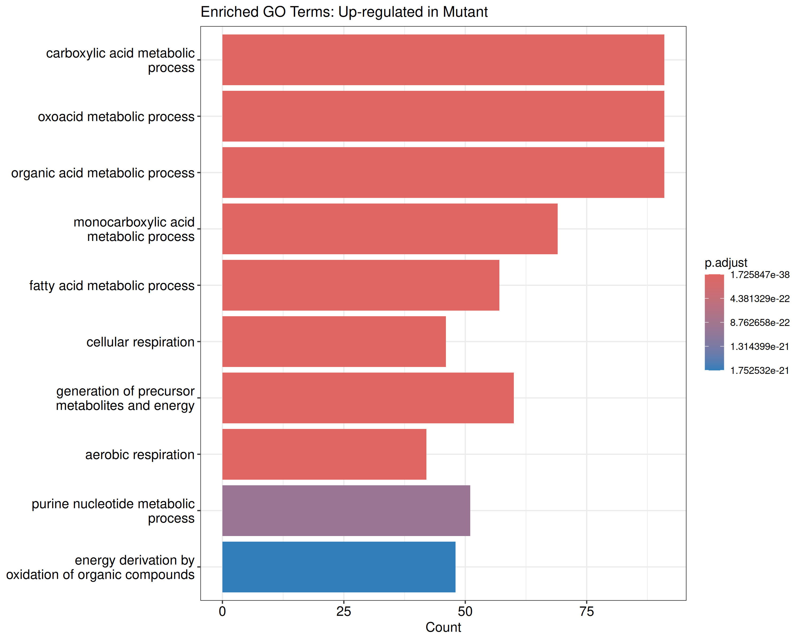<!-- -->

alt=“GO Term Analysis” /\>

``` r
if (nrow(ego_down) > 0) {
  barplot(ego_down, showCategory = 10) + ggtitle("Enriched GO Terms: Down-regulated in Mutant")
}
```

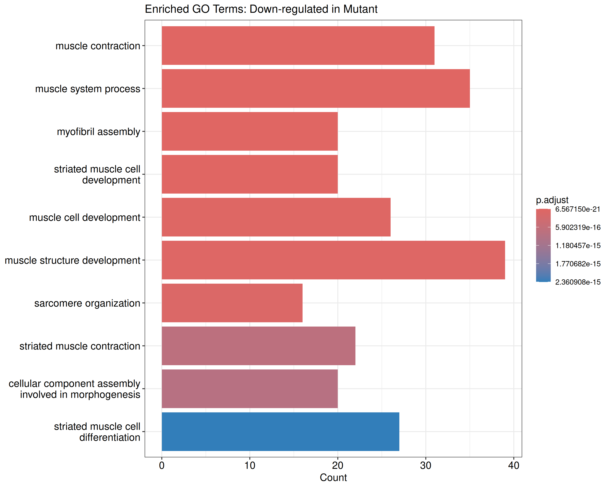<!-- -->

alt=“GO Term Analysis” /\>

``` r
plot_strict_bar <- function(ego_obj, title) {
  
  # 1. Create a copy to filter data safely
  ego_filtered <- ego_obj
  
  # 2. Filter: Keep only rows where p.adjust < 0.0001
  ego_filtered@result <- ego_filtered@result[ego_filtered@result$p.adjust < 0.0001, ]
  
  # 3. Check if any data remains
  if (nrow(ego_filtered) > 0) {
    
    # --- NEW LOGIC: Create Alternating Colors ---
    # We need to know how many bars will be shown.
    # It is the minimum of 10 (your showCategory) OR the total rows available.
    n_bars <- min(nrow(ego_filtered@result), 10)
    
    # Create a vector that repeats "black", "grey50" exactly n_bars times
    # "grey50" is a good dark gray that is readable but distinct from black
    axis_colors <- rep(c("black", "blue"), length.out = n_bars)
    
    # 4. Generate Plot
    p <- barplot(ego_filtered, showCategory = 10) + 
      ggtitle(title) +
      
      # Force Red Color
      scale_fill_gradient(low = "red", high = "red") + 
      
      # Font & Size Settings
      theme_bw(base_size = 14, base_family = "Arial") + 
      theme(
        legend.position = "none",
        
        plot.title = element_text(family = "Arial", size = 20, face = "bold", hjust = 0.5),
        
        # --- APPLY ALTERNATING COLORS HERE ---
        # We pass the vector 'axis_colors' instead of a single string
        axis.text.y = element_text(family = "Arial", size = 20, color = axis_colors),
        
        axis.text.x = element_text(family = "Arial", size = 20, color = "black"),
        axis.title = element_text(family = "Arial", size = 20, face = "bold"),
        
        panel.grid.minor = element_blank(),
        panel.grid.major.y = element_blank()
      )
      
    print(p)
    
  } else {
    print(paste("No terms found with p < 0.0001 for:", title))
  }
}

# --- Execute ---
plot_strict_bar(ego_up, "Enriched GO Terms: Up-regulated in Mutant (p < 0.0001)")
```

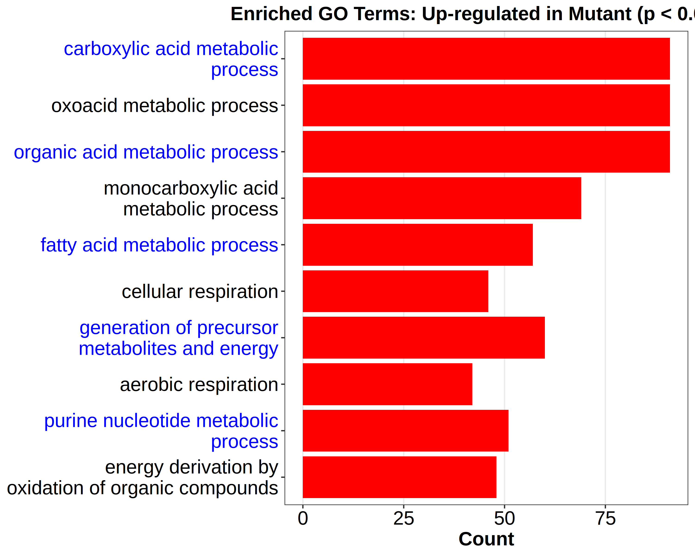<!-- -->

alt=“GO Term Analysis” /\>

``` r
plot_strict_bar(ego_down, "Enriched GO Terms: Down-regulated in Mutant (p < 0.0001)")
```

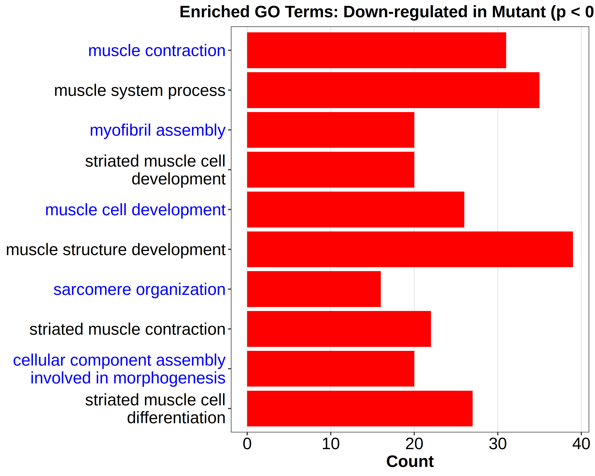<!-- -->

alt=“GO Term Analysis” /\>

``` r
# 1. EXTRACT AND PREPARE DATA
# ---------------------------------------------------------
# Extract the result tables
up_df <- as.data.frame(ego_up)
down_df <- as.data.frame(ego_down)

# Add a column to distinguish direction
up_df$Direction <- "Up-regulated"
down_df$Direction <- "Down-regulated"

# Combine them
combined_go <- rbind(up_df, down_df)

# 2. FILTER TOP TERMS WITH CUSTOM RULES
# ---------------------------------------------------------

# IDs/Terms to Remove
remove_ids <- c(
  "GO:0003012", # muscle system process
  "GO:0051146", # striated muscle cell differentiation
  "GO:0010927", # cellular component assembly involved in morphogenesis
  "GO:0045333", # cellular respiration
  "GO:0042773"  # ATP synthesis coupled electron transport
)

# Filter out unwanted terms (by ID and Description)
filtered_go <- combined_go %>%
  filter(!ID %in% remove_ids) %>%
  filter(!grepl("muscle cell development", Description, ignore.case = TRUE))

# Terms to Force Include for Down-regulated
force_include_down <- c("GO:0051216", "GO:0030198")

# Terms to Force Include for Up-regulated (Add the same terms here if you want them checked in UP too)
force_include_up <- c("GO:0051216", "GO:0030198")

# Helper function to select top N terms with forced inclusion
select_top_terms <- function(df, direction, n = 10, force_ids = NULL) {
  subset_df <- df %>% filter(Direction == direction)
  
  # Split into forced and others
  forced_df <- subset_df %>% filter(ID %in% force_ids)
  other_df <- subset_df %>% filter(!ID %in% force_ids)
  
  # Select top from others to fill remaining slots
  n_remaining <- max(0, n - nrow(forced_df))
  top_others <- other_df %>%
    arrange(p.adjust) %>%
    head(n_remaining)
  
  # Combine
  rbind(forced_df, top_others)
}

# Apply selection
top_up <- select_top_terms(filtered_go, "Up-regulated", n = 10, force_ids = force_include_up)
top_down <- select_top_terms(filtered_go, "Down-regulated", n = 10, force_ids = force_include_down)

top_go <- rbind(top_up, top_down)

# 3. CALCULATE GENERATIO (Numeric)
# ---------------------------------------------------------
# ClusterProfiler gives GeneRatio as "5/100". We need a number (0.05) for plotting.
top_go$GeneRatioNum <- sapply(top_go$GeneRatio, function(x) eval(parse(text=x)))

# 4. CREATE THE COMBINED PLOT
# ---------------------------------------------------------
ggplot(top_go, aes(x = GeneRatioNum, 
                   y = reorder(Description, GeneRatioNum))) + # Sort Y axis by ratio
  
  # The Bubble Points
  geom_point(aes(size = Count, color = p.adjust)) +
  
  # Split the plot into two panels (Up vs Down)
  facet_grid(Direction ~ ., scales = "free_y", space = "free_y") +
  
  # CUSTOM COLOR SCALE (0.001, 0.01, 0.05)
  # using 'trans = "log10"' helps visualize small p-values better
  scale_color_gradientn(
  colors = c("blue", "cyan", "yellow", "orange", "red"),
  values = scales::rescale(log10(c(0.3, 0.05, 0.01, 0.001, 0.0001))),
  trans = "log10",
  limits = c(0.3, 0.0001),
  oob = scales::squish,
  breaks = c(0.3, 0.05, 0.01, 0.001, 0.0001),
  labels = scales::scientific,
  name = "p.adjust") +
  
  # Clean up the labels
  labs(
    title = "GO Enrichment: Mutant vs Control",
    x = "Gene Ratio",
    y = NULL,
    size = "Gene Count"
  ) +
  
  theme_bw(base_size = 14) +
  theme(
    strip.text = element_text(face = "bold", size = 14),     # Style the facet labels
    strip.background = element_rect(fill = "grey90"),        # Background of facet labels
    axis.text.y = element_text(size = 14),
    panel.grid.major.x = element_line(linetype = "dashed")   # Add vertical grid lines
  )
```

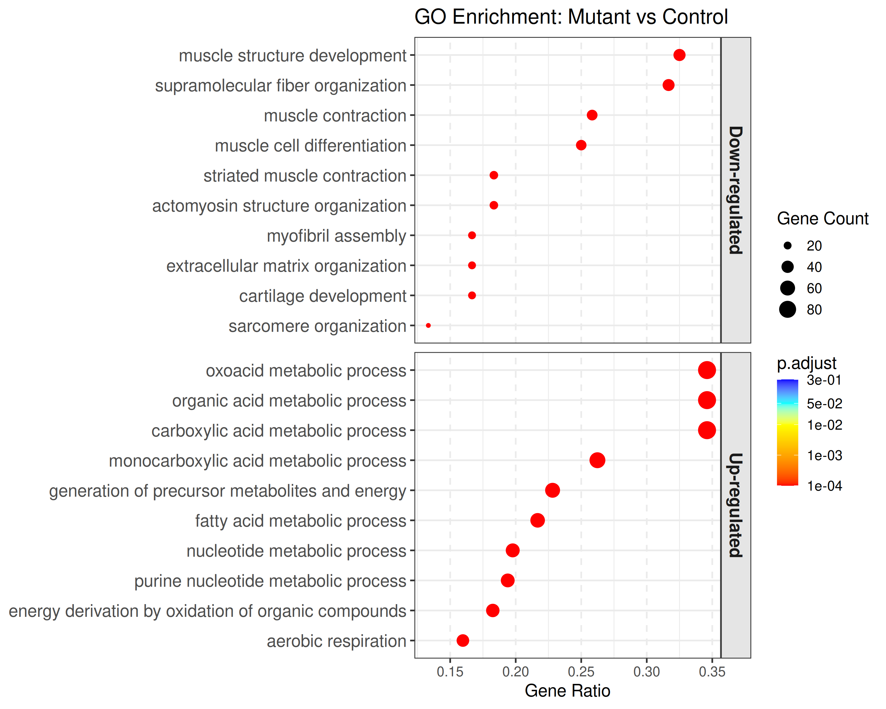<!-- -->

alt=“GO Term Analysis” /\>

## GSEA Enrichment Analysis (GO Terms)

This analysis uses the full ranked list of genes (not just significant
ones) to identify gene sets (GO Biological Processes) that are
coordinately up- or down-regulated at the top or bottom of the list.

``` r
library(enrichplot)

# 1. Prepare Ranked List
# We use the 'de_df' which contains the No-Muscle DE results
# Rank by avg_log2FC (descending)
gene_list <- de_df$avg_log2FC
names(gene_list) <- de_df$gene
gene_list <- sort(gene_list, decreasing = TRUE)

# 2. Map Symbols to Entrez IDs
# gseGO requires Entrez IDs for better mapping
ids <- bitr(names(gene_list), fromType = "SYMBOL", toType = "ENTREZID", OrgDb = org.Mm.eg.db)

# Remove duplicates and NAs
ids <- ids[!duplicated(ids$SYMBOL), ]
gene_list <- gene_list[ids$SYMBOL]
names(gene_list) <- ids$ENTREZID

# 3. Run GSEA (gseGO)
# Seed for reproducibility
set.seed(123)

gsea_go <- gseGO(
  geneList     = gene_list,
  OrgDb        = org.Mm.eg.db,
  ont          = "BP",
  minGSSize    = 10,
  maxGSSize    = 500,
  pvalueCutoff = 0.25, # Relaxed for discovery
  verbose      = FALSE
)

# 4. Visualize Results
if (!is.null(gsea_go) && nrow(gsea_go) > 0) {
  
  # Print top results
  cat("Top GSEA Pathways:\n")
  print(head(as.data.frame(gsea_go)))
  
  # Dotplot of GSEA results
  p1 <- dotplot(gsea_go, showCategory=10, split=".sign") + facet_grid(.~.sign) + ggtitle("GSEA GO: Dotplot")
  print(p1)
  
  # --- GSEA ENRICHMENT PLOT (The "Mountain" Plot) ---
  
  # Define pathways of interest (manually selected)
  # You can change these IDs or Descriptions to pick different ones
  target_gsea_terms <- c("GO:0051216", "GO:0030198") # cartilage dev, ECM org
  
  # Check if they exist in the results
  available_targets <- target_gsea_terms[target_gsea_terms %in% gsea_go$ID]
  
  if (length(available_targets) > 0) {
    cat("\nPlotting GSEA for manually selected target terms:", paste(available_targets, collapse=", "), "\n")
    
    # Plot specific targets
    p2 <- gseaplot2(gsea_go, geneSetID = available_targets, title = "GSEA: Selected Pathways")
    print(p2)
    
  } else {
    # Fallback: Plot Top 1 if targets not found
    top_pathway_id <- gsea_go@result$ID[1]
    top_pathway_desc <- gsea_go@result$Description[1]
    cat("\nTarget terms not significant in GSEA. Plotting Top 1 pathway:", top_pathway_desc, "\n")
    
    p2 <- gseaplot2(gsea_go, geneSetID = 1, title = top_pathway_desc)
    print(p2)
  }
  
} else {
  cat("No significant GSEA pathways found with current cutoff.\n")
}
```

    ## Top GSEA Pathways:
    ##                    ID                                           Description
    ## GO:0010927 GO:0010927 cellular component assembly involved in morphogenesis
    ## GO:0006936 GO:0006936                                    muscle contraction
    ## GO:0051146 GO:0051146                  striated muscle cell differentiation
    ## GO:0030239 GO:0030239                                    myofibril assembly
    ## GO:0055002 GO:0055002                      striated muscle cell development
    ## GO:0055001 GO:0055001                               muscle cell development
    ##            setSize enrichmentScore       NES pvalue     p.adjust       qvalue
    ## GO:0010927      51      -0.8105073 -3.803469  1e-10 7.629545e-09 6.447368e-09
    ## GO:0006936     102      -0.6790207 -3.785475  1e-10 7.629545e-09 6.447368e-09
    ## GO:0051146     115      -0.6650180 -3.782561  1e-10 7.629545e-09 6.447368e-09
    ## GO:0030239      33      -0.9058758 -3.776751  1e-10 7.629545e-09 6.447368e-09
    ## GO:0055002      33      -0.9058758 -3.776751  1e-10 7.629545e-09 6.447368e-09
    ## GO:0055001      88      -0.6991303 -3.727398  1e-10 7.629545e-09 6.447368e-09
    ##            rank                  leading_edge
    ## GO:0010927  237 tags=55%, list=6%, signal=52%
    ## GO:0006936  153 tags=35%, list=4%, signal=35%
    ## GO:0051146  261 tags=38%, list=7%, signal=37%
    ## GO:0030239  121 tags=76%, list=3%, signal=74%
    ## GO:0055002  121 tags=76%, list=3%, signal=74%
    ## GO:0055001  261 tags=41%, list=7%, signal=39%
    ##                                                                                                                                                                                                                                                                         core_enrichment
    ## GO:0010927                                                                                                  16691/22003/269116/19153/16669/12373/230822/78321/50874/12372/24131/17930/59011/68794/21957/228003/22138/11459/21955/13009/140781/22437/11472/21393/18175/59006/93677/17906
    ## GO:0006936                                                   63873/68268/74166/17929/12845/12373/22004/228785/50874/56012/17907/11474/12372/17930/11937/17901/21957/71912/21953/17879/21925/22138/21955/20190/13009/140781/17897/109272/11472/17883/21393/21924/93677/21952/17882/17906
    ## GO:0051146 106628/77578/11790/16691/79362/12818/22003/18019/57810/74490/65256/16669/23892/20997/18133/12373/228785/78321/12180/116904/50874/11474/12372/24131/17930/59011/74376/68794/21957/228003/22138/11459/21955/20190/13009/140781/22437/11472/21393/18175/59006/93677/56642/17906
    ## GO:0030239                                                                                                                      16691/22003/16669/12373/78321/50874/12372/24131/17930/59011/68794/21957/228003/22138/11459/21955/13009/140781/22437/11472/21393/18175/59006/93677/17906
    ## GO:0055002                                                                                                                      16691/22003/16669/12373/78321/50874/12372/24131/17930/59011/68794/21957/228003/22138/11459/21955/13009/140781/22437/11472/21393/18175/59006/93677/17906
    ## GO:0055001                                                  106628/11790/16691/12818/22003/18019/65256/16669/12845/12373/78321/116904/50874/11474/12372/24131/17930/59011/74376/68794/21957/17306/228003/22138/11459/21955/20190/13009/140781/22437/11472/21393/18175/59006/93677/17906

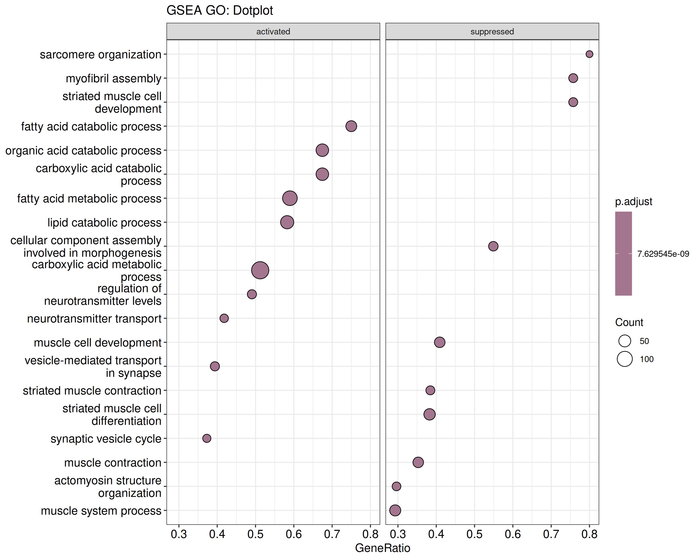<!-- -->

    ## 
    ## Plotting GSEA for manually selected target terms: GO:0051216, GO:0030198

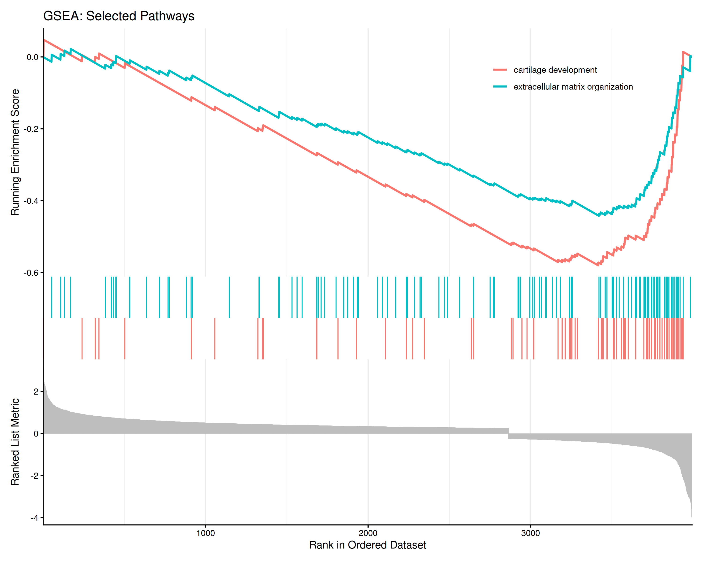<!-- -->

alt=“GSEA Enrichment Plots for Top Pathways” /\> Pathways
</figcaption>
alt=“GSEA Enrichment Plots for Top Pathways” /\> Pathways
</figcaption>

## Cluster Signatures Plot (The Ridge Plot)

This analysis used multiple gene lists. Each list contained all the
marker genes for a specific cell type (e.g., all chondrocyte markers),
regardless of whether they were differentially expressed between Mutant
and Control.

The Biological Question: “Are the entire gene programs that define
specific cell types being pushed towards an up-regulated or
down-regulated state in the mutant?” The Insight: This plot gives a
higher-level, systems-biology view. It’s a discovery tool that reveals
which entire cell populations are most impacted by the mutation, not
just a handful of pre-selected DE genes. It showed that the entire
chondrocyte and progenitor cell programs were being activated.

``` r
# 1. Prepare the ranked gene list (you've already done this)
ranked_gene_list <- de_df$avg_log2FC
names(ranked_gene_list) <- de_df$gene
ranked_gene_list <- sort(ranked_gene_list, decreasing = TRUE)

# 2. Prepare the TERM2GENE data frame from your cluster markers
# This assumes the `de_cluster` data frame is available from FindAllMarkers()
cluster_genesets <- de_cluster %>%
  # Optional: Filter for stronger markers if the list is too long
  filter(avg_log2FC > 0.25 & p_val_adj < 0.05) %>% 
  # Use dplyr::select() to be explicit
  dplyr::select(term = cluster, gene = gene)

# Keep ridge plot labels simple—cluster numbers only
cluster_genesets$term <- paste0("Cluster_", cluster_genesets$term)

cat("Preview of the Cluster Marker Gene Sets:\n")
```

    ## Preview of the Cluster Marker Gene Sets:

``` r
head(cluster_genesets)
```

<div data-pagedtable="false">

<script data-pagedtable-source type="application/json">
{"columns":[{"label":[""],"name":["_rn_"],"type":[""],"align":["left"]},{"label":["term"],"name":[1],"type":["chr"],"align":["left"]},{"label":["gene"],"name":[2],"type":["chr"],"align":["left"]}],"data":[{"1":"Cluster_0","2":"Comp","_rn_":"Comp"},{"1":"Cluster_0","2":"Col2a1","_rn_":"Col2a1"},{"1":"Cluster_0","2":"Chad","_rn_":"Chad"},{"1":"Cluster_0","2":"Clec3a","_rn_":"Clec3a"},{"1":"Cluster_0","2":"Col9a1","_rn_":"Col9a1"},{"1":"Cluster_0","2":"Sparc","_rn_":"Sparc"}],"options":{"columns":{"min":{},"max":[10]},"rows":{"min":[10],"max":[10]},"pages":{}}}
  </script>

</div>

``` r
# 3. Run GSEA
gsea_result_clusters <- GSEA(
  geneList     = ranked_gene_list,
  TERM2GENE    = cluster_genesets,
  pvalueCutoff = 0.25,
  verbose      = FALSE
)

cat("\n--- GSEA Results for Cluster Markers ---\n")
```

    ## 
    ## --- GSEA Results for Cluster Markers ---

``` r
print(as.data.frame(gsea_result_clusters))
```

    ##                  ID Description setSize enrichmentScore       NES      pvalue
    ## Cluster_0 Cluster_0   Cluster_0     118      -0.8075795 -4.528872 1.00000e-10
    ## Cluster_6 Cluster_6   Cluster_6     229       0.6307981  3.894695 1.00000e-10
    ## Cluster_1 Cluster_1   Cluster_1      36      -0.8561258 -3.626806 1.00000e-10
    ## Cluster_4 Cluster_4   Cluster_4     244       0.2670097  1.659627 3.36732e-04
    ##               p.adjust qvalue rank                   leading_edge
    ## Cluster_0 1.333333e-10     NA  564 tags=81%, list=14%, signal=71%
    ## Cluster_6 1.333333e-10     NA  629 tags=51%, list=15%, signal=46%
    ## Cluster_1 1.333333e-10     NA  360  tags=89%, list=9%, signal=82%
    ## Cluster_4 3.367320e-04     NA 2930 tags=96%, list=72%, signal=29%
    ##                                                                                                                                                                                                                                                                                                                                                                                                                                                                                                                                                                                                                                                                                                                                                                                                                                                                                                                                                                                                                                                                                                                                                                                                                                                                                                                                                                                                                                                                                                                      core_enrichment
    ## Cluster_0                                                                                                                                                                                                                                                                                                                                                                                                                                                                                                                                                                                                                                                                                                                                                                                                                                                                                                                                     Phldb1/Trim47/Thbs1/Pamr1/B4galnt3/Col3a1/Dpt/Thbs3/Dcn/Gsn/Fosb/Trps1/Pam/Wwp2/Col6a3/Dkk3/Fgfrl1/Col8a1/Pkd2/Sdc4/Eln/Loxl3/Cdkn1c/Matn2/Igfbp6/Fn1/Col6a1/Bgn/Igfbp7/Wif1/Fibin/Pcsk6/Sertad4/Chst11/Col15a1/Prelp/Col27a1/Fbln7/Ecm2/Cilp2/Fmod/Col14a1/Mn1/Ccn1/Pdgfrl/Nt5e/Setbp1/Plod2/Col6a2/Nfatc2/Extl1/Chadl/Emilin3/Dlk1/Meltf/Cytl1/Trpv4/Pax1/Abi3bp/Mgp/Anxa8/Susd5/Scrg1/Ndufa4l2/Clu/Gas1/Shisa2/Col9a1/Sox9/Stc2/Col2a1/Snorc/Clec3a/Comp/Thbs4/Hapln1/Chad/Col9a3/Grem1/Cilp/Acan/Clec3b/Col9a2/Frzb/Matn3/Calml3/Ckm/Fhl1/Cnmd/Matn1/Tnnt3/Myh1/Angptl7/Hspb7/Myh2
    ## Cluster_6                                                                                                                                                                                                                                                                                                                                                                                                                                                                                                                                                                                                                                                                                                                                                                                                 Syt4/Vip/Hand2/Dbh/Sult4a1/Th/Ntrk1/Stmn2/Syn2/Pcsk1n/Sst/Prph/Gata2/Phox2a/Chrna3/Slc6a2/Gap43/Rab3b/Stmn3/Lrp11/6330403K07Rik/Nsg2/Syn1/Sfrp1/Cend1/Sncg/Rgs7/Chga/Slc18a2/Ngfr/Gal/Ddc/Cyb561/Syp/Tubb3/Syt7/L1cam/Nrcam/Parm1/Hpcal4/Cplx1/Gnao1/Apba1/Tagln3/Map6/Uchl1/Rtn1/Trnp1/Cadm3/Bex2/Ptprn/Snap25/Nsg1/Syt9/Fabp7/Cox8b/Spock2/Dipk1b/Pcbp3/Snhg11/Snap91/Mcam/Cfd/Ctxn1/Acsbg1/Azin2/Eci1/Nnat/Cidea/Hid1/Brsk1/Nap1l5/Flrt1/Fmn1/Kcnab2/Mllt11/Camk2n2/Gm13889/Cntfr/Fabp4/Cbarp/Ptger3/Ndrg4/Rgs9/Arhgap28/Tspan18/Thy1/Akap6/Pacsin1/Rab3a/Kif5c/Reep1/Aldoc/Npy/Tuba1a/Vat1l/Rgs4/Echs1/Zfr2/Eno2/Dgkh/Tril/Ccdc92/Zdhhc2/Tspyl4/Hmgcs1/Ndn/Nipal3/Dbi/Ank2/Syngr1/Cd151/Mdh1/Parva/Atl1/Fam89a/Epb41l3
    ## Cluster_1                                                                                                                                                                                                                                                                                                                                                                                                                                                                                                                                                                                                                                                                                                                                                                                                                                                                                                                                                                                                                                                                                                                                                                                                                                                                                                                        Acta2/Dst/Sostdc1/Car3/Lgals3/Tmem163/Ppp1r3c/Pde1a/Krt8/Lyst/Rab38/Tpm1/Tmem255a/Adcy5/Susd5/Ndufa4l2/Slc2a1/Zim1/Ppfia4/Krt19/Jph2/Fxyd6/Krt7/T/Acan/Serpina1e/Arhgef16/Cryab/Myh1/Ttn/Csrp3/Tcap
    ## Cluster_4 Eif2ak2/Tex9/Rasal3/Ly6d/Nt5c3/Fcnb/Pirb/Lamtor5/Svip/Mpeg1/Slfn14/C3/Elovl1/Pttg1/Pik3ap1/Cand1/Ptpn7/Epc1/Sfxn1/Arhgap9/B9d2/Rnf20/Mlec/Fcrla/Smg6/Igll1/Gba2/Bglap/Pik3cg/Nrros/Mpo/Srsf5/Btk/Gpr141/Imp3/Iglc1/Ncbp1/Laptm5/Elane/Pop7/Ms4a1/Cdk2ap2/Rab44/Prtn3/Tkt/Ndufb1-ps/Cd79b/Mzb1/Lin28a/Ints7/Inpp5d/H2-T23/Mpp1/Slc25a51/Foxm1/Clec12a/Hdac2/Smdt1/Pld4/Emb/Eed/Cenpk/Sowaha/Nadk2/Abcg2/Ppil1/Snap29/E2f7/Sh3bgrl3/Slc16a10/Fam126a/Syk/Dusp2/Arhgef18/Dynll1/Pqbp1/B4galnt1/Mybl2/Pdia2/Prkcd/Slirp/Blnk/Bach2/Gna15/Hmox1/Gpsm3/Sae1/Cd72/Eloa/B2m/Ube2o/Cybb/Pax5/Eri1/Ncf4/Grina/Cyb561a3/Bub1b/Rasgrp1/4930404N11Rik/Ncapg/Adar/Rhog/Ube2a/Pygl/Parpbp/Arpc4/Uckl1/Bloc1s3/Sbf1/Hcls1/Tmem123/Cecr2/E130309D02Rik/Cln8/Iba57/Cybc1/Ptprcap/Ltf/Ccr2/Pon2/Itgb2/Snrpd1/Aldh3b1/Nfam1/Zeb2/Capza2/E2f3/Cmc2/Tbxas1/Rad21/Ifitm6/Fcna/Trub2/Prkcb/Gmeb2/Psma2/Vcam1/Igkc/Hpf1/S100a9/Mtmr3/Tcp11l2/Dgkd/Orc2/Ltb4r1/Cyfip2/A630001G21Rik/Exosc7/H2-T24/Was/Mcemp1/Cdc42se2/Armt1/Cpeb4/Trpv2/Ighj1/Tmem131l/Olfm4/Ncbp3/Akna/Tent5c/Selplg/Alad/Vti1a/Eif5/Fgd3/Ncoa4/Ssr4/Tpt1/Stxbp2/Slc25a39/Rhoa/Pum2/Pxk/Otud5/Lyn/Cd52/Wrn/Zfp39/Cxcl12/2310009A05Rik/Tmem14c/Jpt1/Ilk/Cep76/Tlnrd1/Spib/Igsf6/Hist1h2bk/Zfp131/Dazap2/Gda/Adgrg1/Timm22/St3gal5/Slc25a5/Smap2/Sec11c/Cdca5/Ctsg/Ctsb/Psme3/Tmsb4x/Otub2/Asns/Hebp1/Dok3/Eif6/Rpa2/Pim1/Ppbp/Ikzf3/Itgam/Top1/Tcof1/Trim56/Mcm5/S100a8/Fam49b/Rinl/Ighm/H2afy/Rcsd1/AI467606/Sirpa/Iqgap3/Oas2/H2-DMb2/Psmd13/Ddx27/Arhgap4/Rasgrp2/Slc9a3r1/Arrdc1

``` r
write.csv(gsea_result_clusters, file = "gsea_result_clusters.csv", row.names = FALSE)

# 4. Visualize the results
# A ridge plot is perfect for comparing the enrichment of all your clusters at once
# 1) Inspect direction from NES (ground truth for up/down)
res <- as.data.frame(gsea_result_clusters) %>%
  mutate(direction = ifelse(NES > 0, "Up in mutant", "Down in mutant")) %>%
  arrange(desc(NES))
res[, c("ID","Description","NES","p.adjust","direction")]  # quick check
```

<div data-pagedtable="false">

<script data-pagedtable-source type="application/json">
{"columns":[{"label":[""],"name":["_rn_"],"type":[""],"align":["left"]},{"label":["ID"],"name":[1],"type":["chr"],"align":["left"]},{"label":["Description"],"name":[2],"type":["chr"],"align":["left"]},{"label":["NES"],"name":[3],"type":["dbl"],"align":["right"]},{"label":["p.adjust"],"name":[4],"type":["dbl"],"align":["right"]},{"label":["direction"],"name":[5],"type":["chr"],"align":["left"]}],"data":[{"1":"Cluster_6","2":"Cluster_6","3":"3.894695","4":"1.333333e-10","5":"Up in mutant","_rn_":"Cluster_6"},{"1":"Cluster_4","2":"Cluster_4","3":"1.659627","4":"3.367320e-04","5":"Up in mutant","_rn_":"Cluster_4"},{"1":"Cluster_1","2":"Cluster_1","3":"-3.626806","4":"1.333333e-10","5":"Down in mutant","_rn_":"Cluster_1"},{"1":"Cluster_0","2":"Cluster_0","3":"-4.528872","4":"1.333333e-10","5":"Down in mutant","_rn_":"Cluster_0"}],"options":{"columns":{"min":{},"max":[10]},"rows":{"min":[10],"max":[10]},"pages":{}}}
  </script>

</div>

``` r
# 2) Build the ridge plot and force symmetry around zero + add a 0-line
p <- ridgeplot(gsea_result_clusters, showCategory = 15) +
  labs(x = "Enrichment Distribution",
       title = "Enrichment of Cluster Signatures in Mutant vs. Control") +
  geom_vline(xintercept = 0, linetype = "dashed")

# Compute symmetric limits from current panel range
gb <- ggplot_build(p)
xr <- gb$layout$panel_params[[1]]$x.range
L  <- max(abs(xr))  # largest absolute bound
p_centered <- p + coord_cartesian(xlim = c(-L, L))

p_centered
```

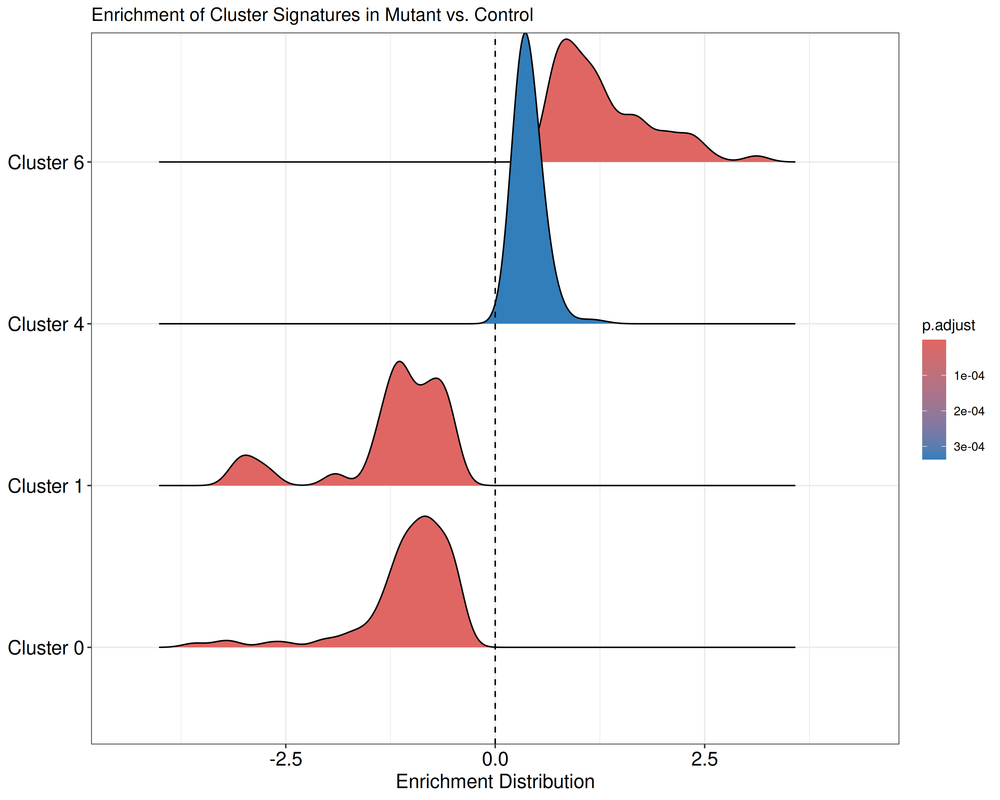<!-- -->

``` r
#Run a second time to recover data that was filtered out in the first run. The first run uses standard/strict defaults, while the second run uses "relaxed" parameters to ensure every cluster appears in your final visualizations.
# 1. Check the size of Cluster 1 BEFORE running GSEA
# This tells us if it exists in your list and how big it is.
cluster_1_count <- sum(cluster_genesets$term == "Cluster_1")
cat("Number of markers for Cluster 1:", cluster_1_count, "\n")
```

    ## Number of markers for Cluster 1: 56

``` r
# 2. Run GSEA with expanded limits
gsea_result_clusters <- GSEA(
  geneList     = ranked_gene_list,
  TERM2GENE    = cluster_genesets,
  pvalueCutoff = 1.0, 
  minGSSize    = 0,      # <--- CRITICAL CHANGE (Default is 10)
  maxGSSize    = 15000,
  verbose      = TRUE
)

# 1. Filter the GSEA result to keep only significant pathways (p.adjust < 0.05)
# We make a copy so we don't lose the original full results
gsea_sig_only <- gsea_result_clusters
gsea_sig_only@result <- gsea_result_clusters@result[gsea_result_clusters@result$p.adjust < 0.05, ]

# 2. Generate the Ridge Plot with only significant clusters
# The color gradient will now automatically adjust to the range of significant p-values
p <- ridgeplot(gsea_sig_only, showCategory = 20) + 
  geom_vline(xintercept = 0, linetype = "dashed") +
  labs(x = "Enrichment Distribution", 
       title = "Significant Cluster Signatures (p < 0.05)") +
  theme(axis.text.y = element_text(size = 12)) # Optional: make labels readable

# 3. Calculate where the 0.05 cutoff falls in the data
# We need this to tell ggplot exactly where to switch colors
p_vals <- gsea_sig_only@result$p.adjust
max_p  <- max(p_vals, na.rm = TRUE)
min_p  <- min(p_vals, na.rm = TRUE)

# If all your p-values are tiny (< 0.05), the plot stays Red.
# If you have non-significant ones, we define the switch point.
limit <- 0.05
# Normalize the limit to a 0-1 scale for the gradient function
scaled_limit <- (limit - min_p) / (max_p - min_p)

# Handle edge cases (e.g., if max_p is < 0.05, scaled_limit would be > 1)
if (scaled_limit < 0) scaled_limit <- 0
if (scaled_limit > 1) scaled_limit <- 1

# 4. Apply the Hard-Switch Color Scale
# Logic: 
# < 0.01: Dark Red (High Significance)
# < 0.05: Light Red (Significant)
# > 0.05: Blue (Not Significant)

  p_colored <- p + 
    scale_fill_gradientn(
      name   = "p.adjust",
      colours = c("red", "firebrick", "lightblue", "darkblue"),
      values  = c(0, 0.01, 0.05, 1),
      limits  = c(0, 1) # Fixed limits from 0 to 1 for consistent legend
    )
  
  print(p_colored)
```

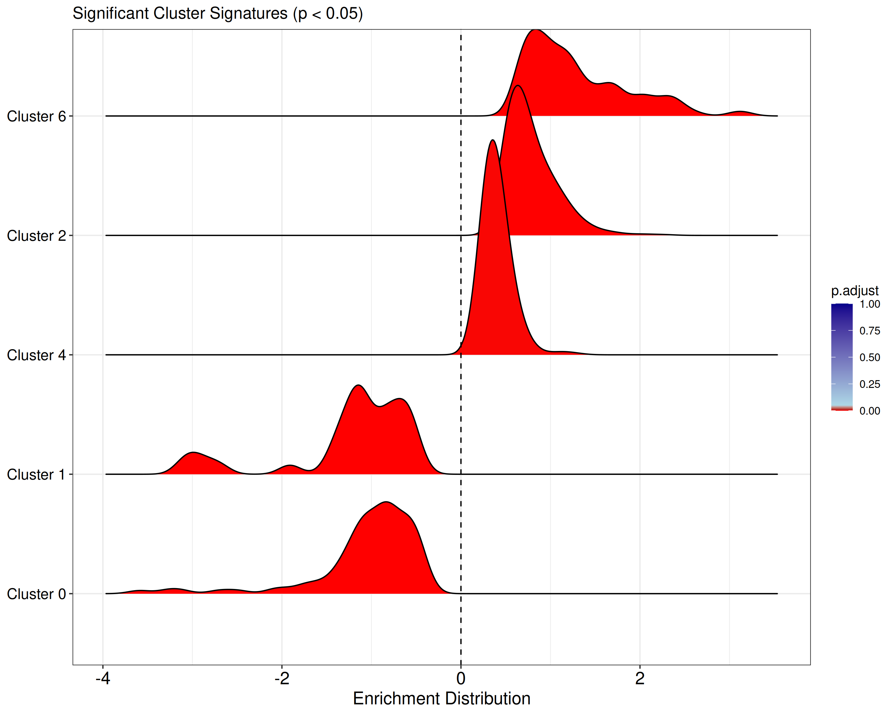<!-- -->

``` r
  # --- NEW: GSEA Enrichment Plot for the Top Result ---
  # This visualizes the running enrichment score for the most significant cluster signature
  if (nrow(gsea_result_clusters) > 0) {
    # Get the ID of the top pathway
    top_cluster_id <- gsea_result_clusters@result$ID[1]
    top_cluster_desc <- gsea_result_clusters@result$Description[1]
    
    cat("\nGenerating Enrichment Plot for Top Cluster Signature:", top_cluster_desc, "\n")
    
    # Create the GSEA plot
    p_enrich <- gseaplot2(gsea_result_clusters, 
                          geneSetID = 1, 
                          title = paste("Enrichment of", top_cluster_desc))
    print(p_enrich)
  }
```

    ## 
    ## Generating Enrichment Plot for Top Cluster Signature: Cluster_0

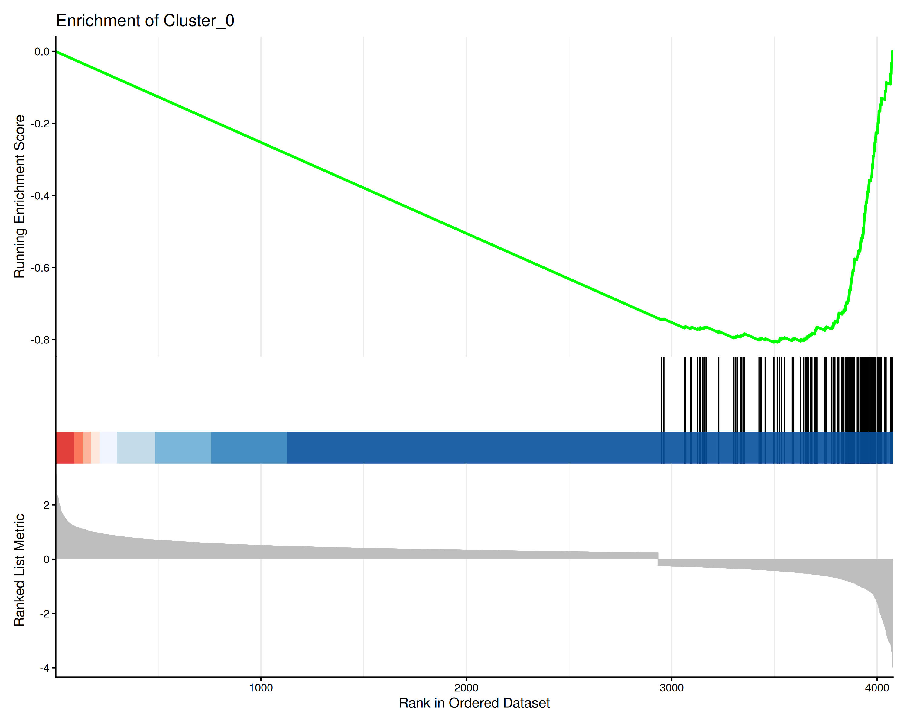<!-- -->

``` r
  write.csv(gsea_result_clusters, file = "gsea_result_clusters.csv", row.names = FALSE)
```

This is a GSEA ridge plot. Here’s what each part means: Each Row:
Represents a gene set made from the marker genes for that specific cell
cluster (e.g., “Cluster 5 Nucleus pulposus progenitor cells”). The
X-Axis (“Enrichment Distribution”): This is your ranked list of genes
based on the log Fold Change from the Mutant vs. Control comparison.
Right side (\> 0): Genes are up-regulated in the Mutant. Left side (\<
0): Genes are down-regulated in the Mutant. The Peaks (Ridges): The
shape shows where the marker genes for that cell type are concentrated
along the ranked list. A peak on the right means most of that cluster’s
marker genes are up-regulated in the mutant. The Color: Shows the
statistical significance (adjusted p-value). Bright red is highly
significant, while blue is less so. Gray or uncolored ridges are not
significant.

# Summary and Conclusions

## Key Findings

1.  **Cell Type Identification**: Identified major IVD cell types.

2.  **Differential Expression**: Found significant gene expression
    changes between mutant and control conditions.

3.  **Integration Results**: Combined analysis revealed genes that are
    both differentially expressed and spatially variable, highlighting
    potential key regulators.

## Biological Implications

- **Disc-Intrinsic Changes**: Analysis focused on the muscle-filtered
  dataset reveals robust differential expression specific to the IVD
  tissue.
- **Extracellular Matrix Genes**: Changes in ECM genes suggest alterations in matrix composition
- **Spatial Markers**: Identified genes with specific spatial patterns
  may play roles in tissue architecture

## Technical Notes

- **Quality Control**: Applied stringent filtering criteria to ensure
  data quality
- **Clustering**: Used resolution 1.3 for optimal cluster identification
- **Annotation**: Applied IVD-specific gene signatures for cell type
  annotation
- **Integration**: Integrated multiple analysis approaches
